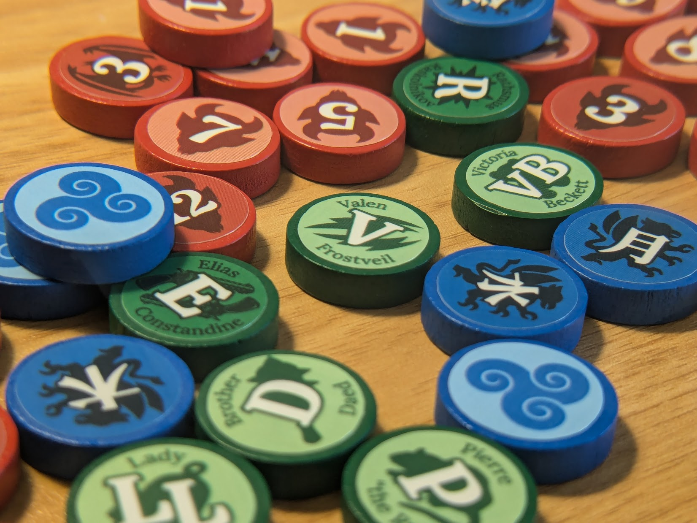
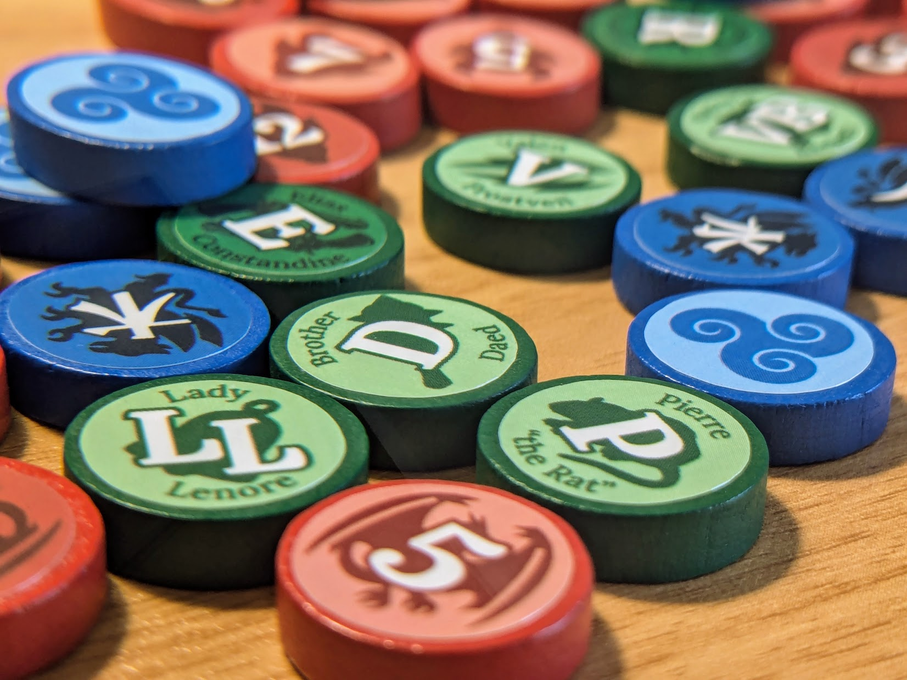
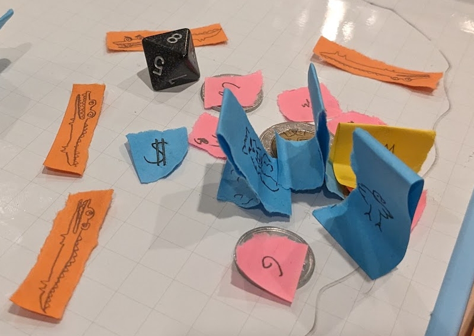
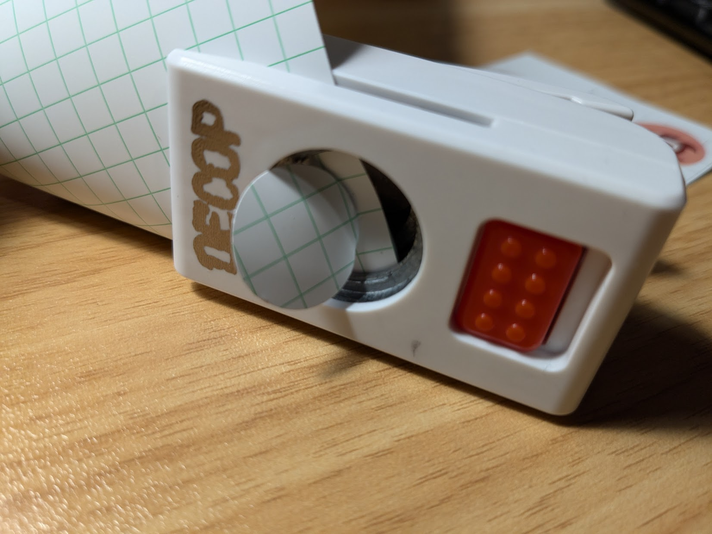
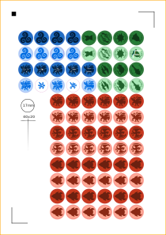
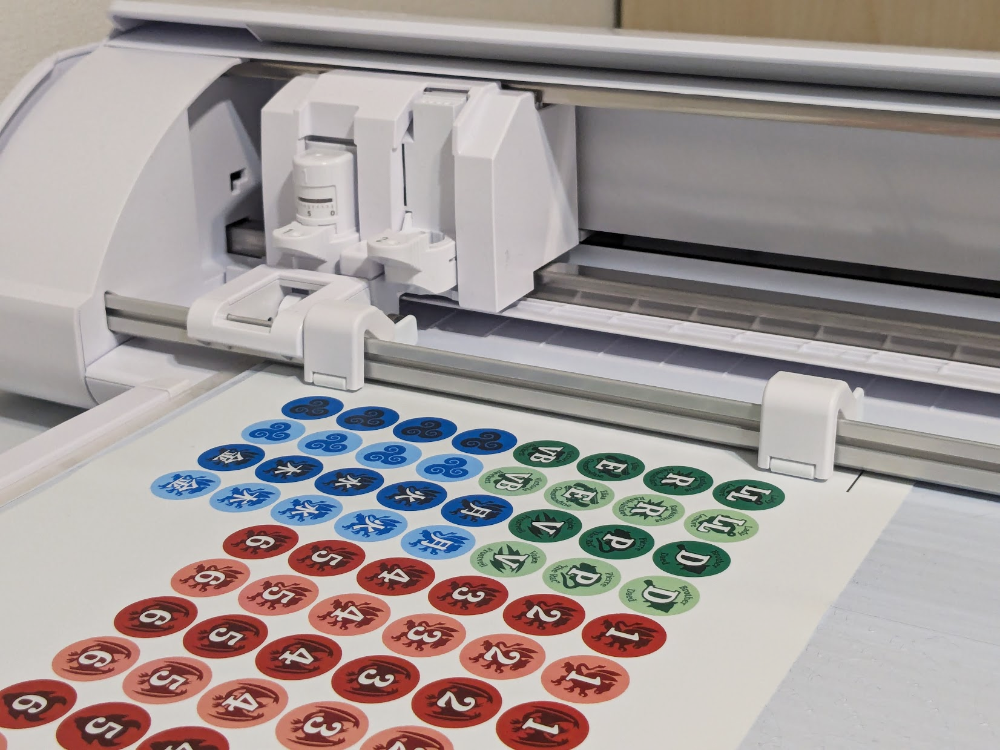
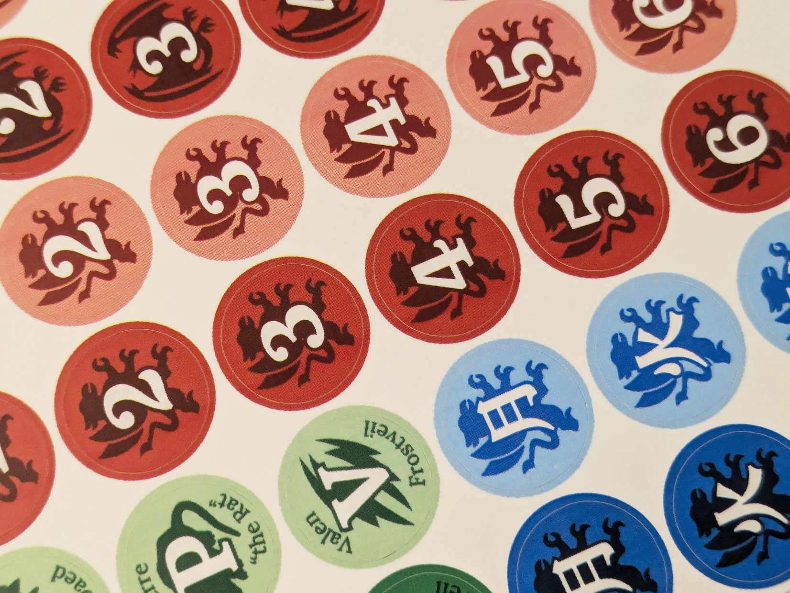
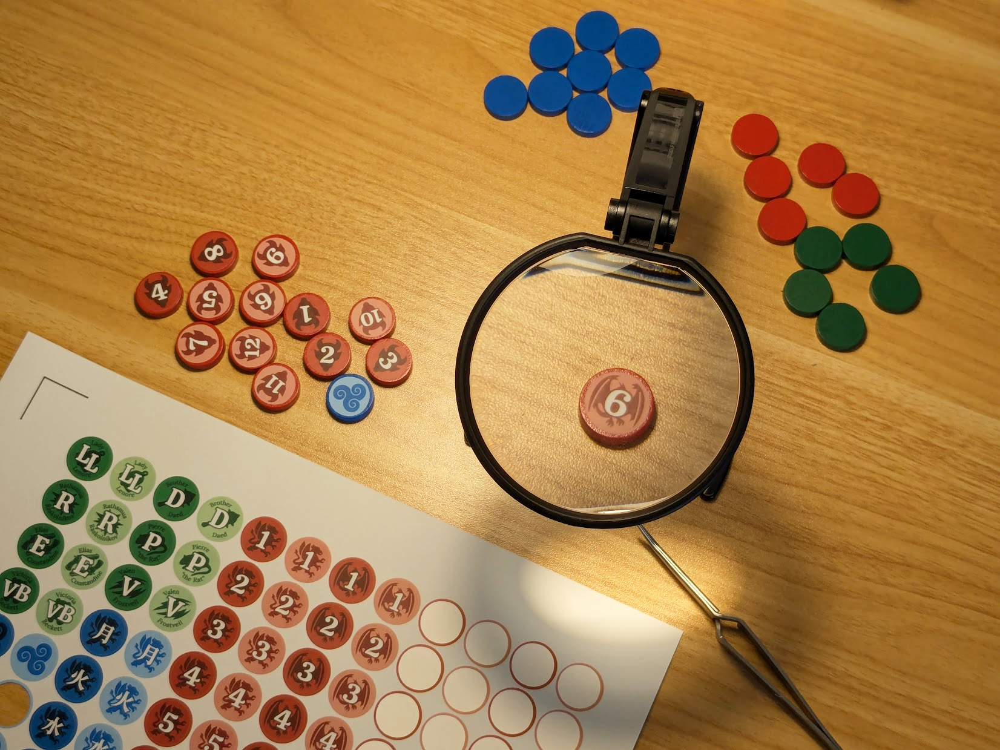
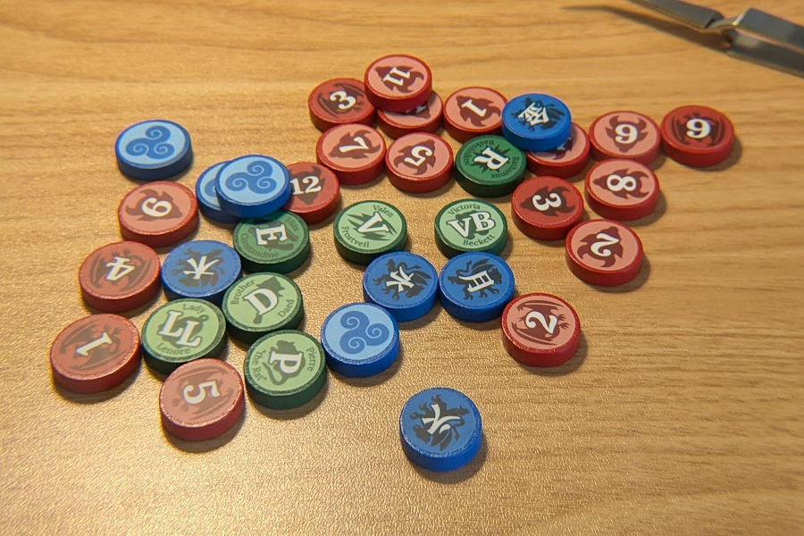

My weekly D&D group has been playing more often at bars, without room for map grids or minis.  I designed a compact set of tokens to help combat run smoothly with limited table space!

* The tokens are multi-colored with bright white labels, to be as readable as possible from a distance in dim bar lighting.
* Each token has "bright" and "dark" sides, which can be used as a binary indicator of low hitpoints or any other condition relevant to the encounter.
* Green player tokens are labeled with character names, initials, and a unique symbol related to the character's backstory.  Red monster tokens are numbered, with two background icons for differentiating enemy types.  Additional blue tokens labeled with kanji can be used for NPCs, items, and other points of interest.

Most of the token symbols come from [game-icons.net](http://game-icons.net)!  Here is the final result:

{/*  */}

For comparison, the charming-but-flimsy sticky notes we used before:

# Cutting Stickers with the Silhouette Cameo

{/* ## Failed Attempt with 17mm Circular Punch

 */}

## Cutting Label Paper with the Silhouette Cameo

Realizing the circular punch wouldn't cut it, I decided to try using 

# Precisely Positioning the Stickers

