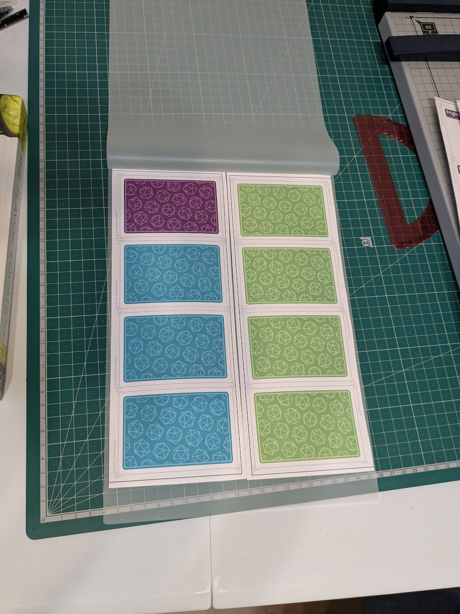

In my weekly D&D group, I play a Paladin who often casts support spells like [Bless](https://roll20.net/compendium/dnd5e/Bless#content) and [Aid](https://roll20.net/compendium/dnd5e/Aid#content) to buff allies in combat.  It's not always easy to remember which effects are active at any given time, so I created a custom deck of _condition cards_ to help keep track.

I designed the cards with Inkscape and used Typst to create a print-and-cut template to aid with assembly.  Here is the final result:

# Goals

* I kept the flavor text to a minimum, as the cards are meant to be a quick reference on the _mechanics_ of a condition during combat.
* I wrote the card descriptions to be as concise as possible while still (hopefully) remaining comprehensible to new players.
* Use color-coded icons when referring to mechanics like attack rolls, damage, defense, and advantage, so that players can easily scan for pertinent information mid-combat.
* The cards should be as robust as possible to spilled drinks and greasy fingers.

Nice-to-haves:

* The cards are designed to be _given away_ to other players, but they also contain enough information to serve as _spell_ cards for myself.
* They should feel good to hold!  In the end, I succeeded in creating cards which are flexible enough to riffle shuffle like real playing cards, thanks to the ["How to Make Game Cards that Shuffle"](https://www.youtube.com/watch?v=DgNJmAkO1_M) guide by Rachel Bruner.

# Prototyping

I tested many different materials to achieve the desired texture and flexibility.

# Card Design

I used Inkscape to design icons and sketch out the basic card layout before 

  As The cards contain mostly text, 

## Front Faces

## Back Faces

# Designing a Parametric Cutting Template with `Typst`

After sketching out the basic card layout with Inkscape, I 

# Assembly Process

## Materials & Equipment

Here is the full list of materials.

* Southworth 25% Cotton 90gsm Paper, Woven Finish
* [GMP *PERFEX Crystal Clear Laminate Film*](https://www.amazon.co.jp/-/en/Flexible-Laminate-Film-Sheer-Micron/dp/B01HE7PI9O) (A4, 50μm, gloss)
* [GMP *Flexible Laminate Film*](https://www.amazon.co.jp/-/en/Flexible-Laminate-Sheer-Micron-Brushed/dp/B079HG676B) (A4, 50μm, matte)
* 3M 77 Spray Glue

And special equipment:

* Kadomaru PRO Corner Rounder
* HFS(R) Guillotine Paper Cutter

## Preparing Printed Templates for Gluing

## Gluing Process

> NEEDS IMAGE

## Laminating the Core

> NEEDS IMAGE

## Laminating the Card Surface

## Cutting Left and Bottom Edges Individually

## Trimming Deck to Final Size

Next, I stack the individually-cut cards with their bottom-left corners aligned, and trim the entire deck to size using a heavy-duty guillotine paper cutter.

> NEEDS IMAGE

## Rounding Corners

I round the corners of each card using a cheap corner punch.  The punch I have struggles to cut cleanly through all 5 layers, sometimes leaving a few incomplete trimmings behind, but overall gets the job done.

# Prototyping with Inkscape

# Creating a Cutting Template with Typst

# Printing and Assembly