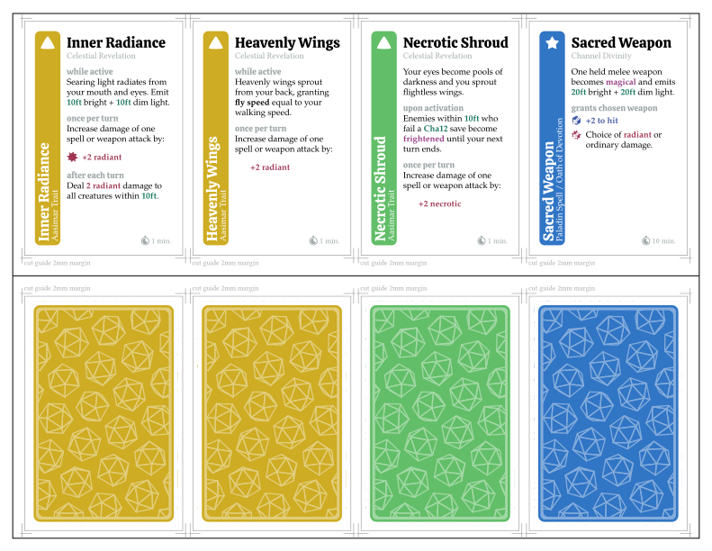
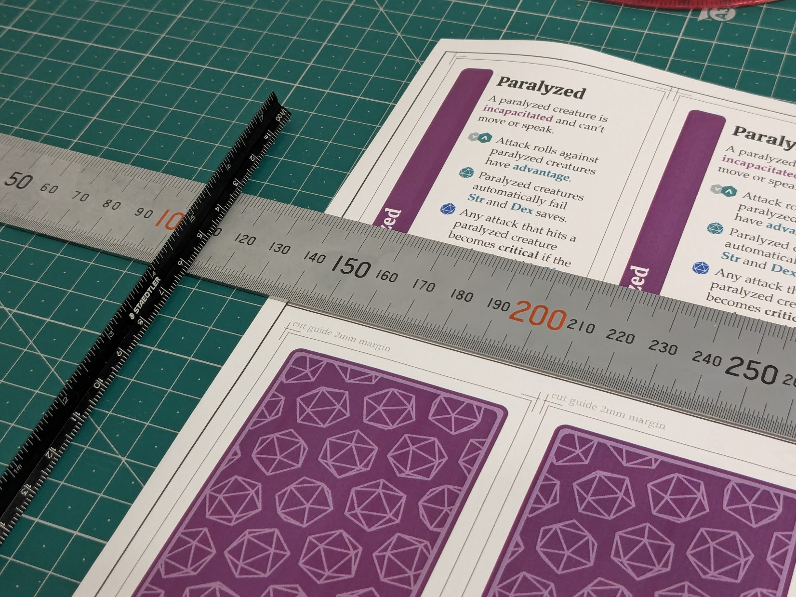
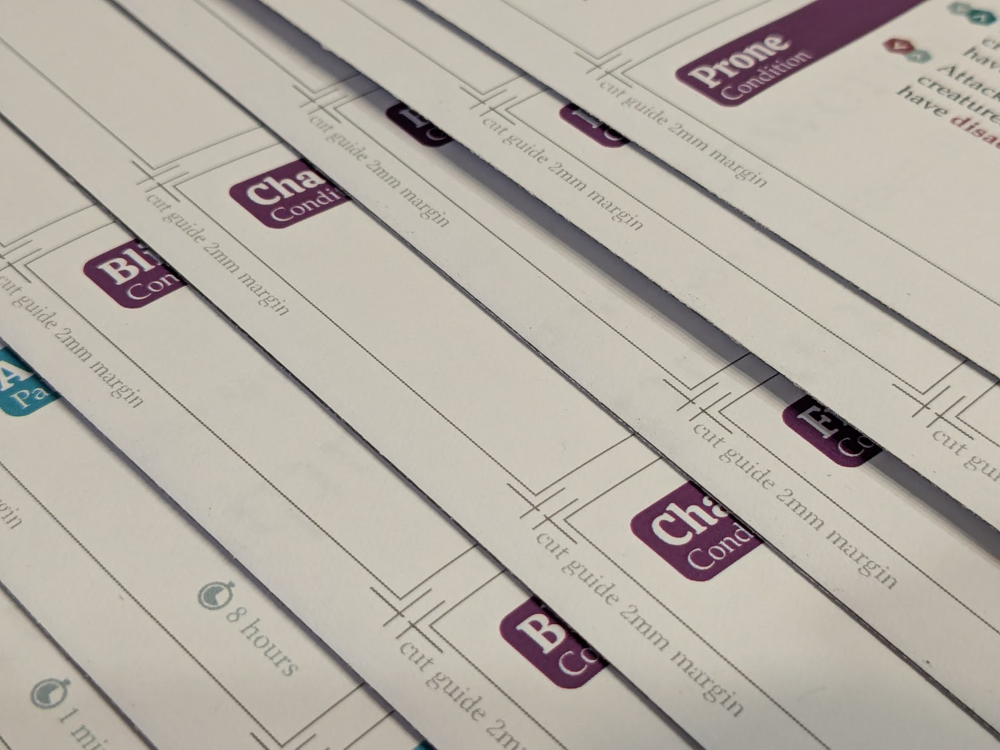
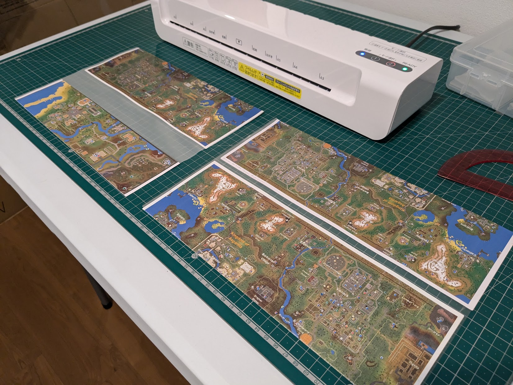
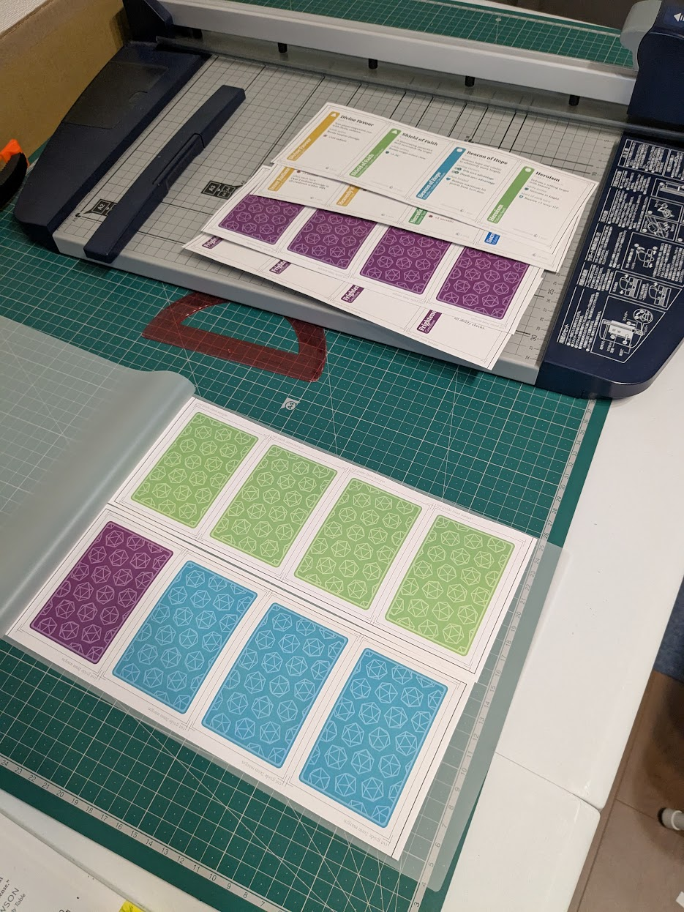
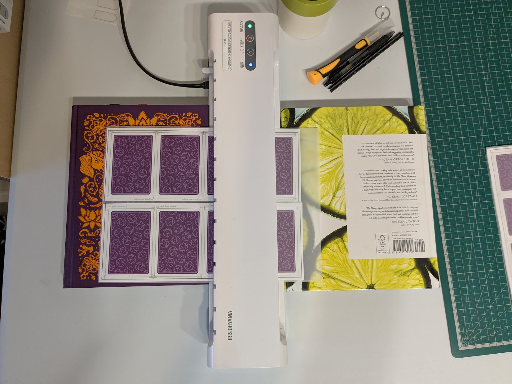
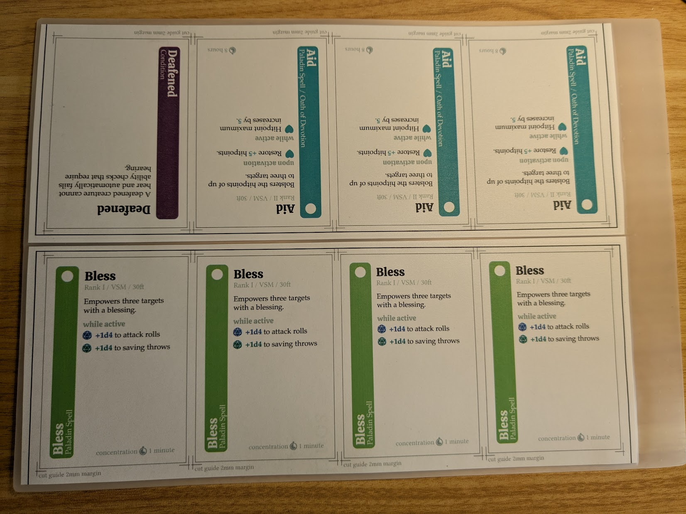
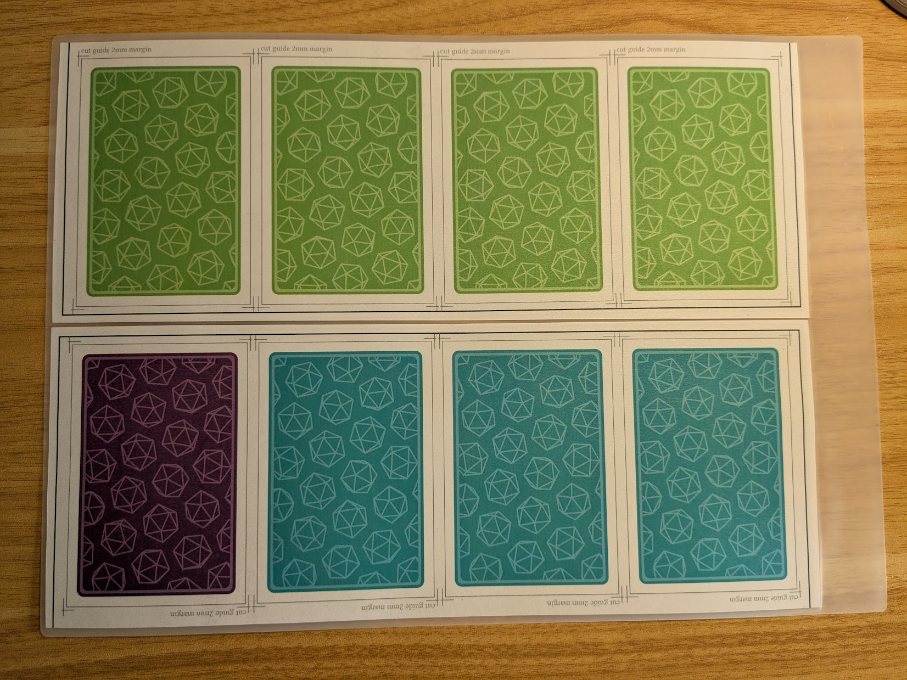
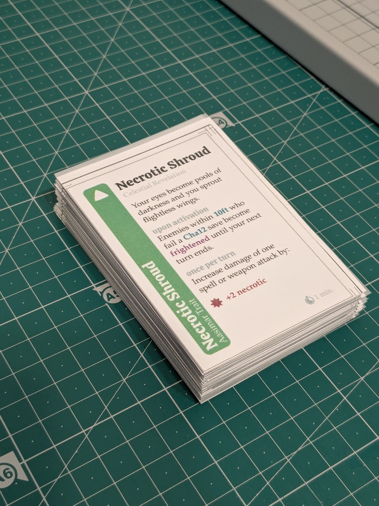
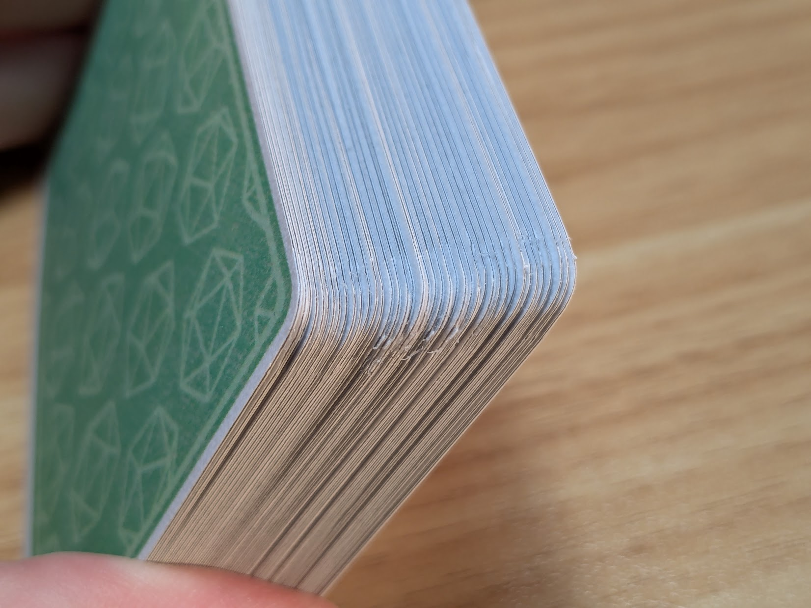

In my weekly D&D group, I play a Paladin who often casts support spells like [Bless](https://roll20.net/compendium/dnd5e/Bless#content) and [Aid](https://roll20.net/compendium/dnd5e/Aid#content) to buff allies in combat.  It's not always easy to remember which effects are active at any given time, so I created a custom deck of _condition cards_ to help keep track!

I designed the cards with Inkscape and used Typst to create a print-and-cut template to aid with assembly.  After several weeks of experimentation with different materials, I succeeded in creating a deck of cards flexible enough to riffle shuffle like real playing cards!

# Designing a Parametric Cutting Template with `Typst`

After sketching the basic card layout in Inkscape, I reproduced the design in Typst and developed a parametric cutting template for assembling cards.

The reverse side of the sheet is printed solid black, so that the cards are fully opaque.

# Assembly Process

## Materials & Equipment

Here is the full list of materials.

* Southworth 25% Cotton 90gsm Paper, Woven Finish
* [GMP *PERFEX Crystal Clear Laminate Film*](https://www.amazon.co.jp/-/en/Flexible-Laminate-Film-Sheer-Micron/dp/B01HE7PI9O) (A4, 50μm, gloss)
* [GMP *Flexible Laminate Film*](https://www.amazon.co.jp/-/en/Flexible-Laminate-Sheer-Micron-Brushed/dp/B079HG676B) (A4, 50μm, matte)
* 3M 77 Spray Glue

And special equipment:

* Kadomaru PRO Corner Rounder
* HFS(R) Guillotine Paper Cutter

## Process

This method is a variation of Rachel Bruner's ["How to Make Game Cards that Shuffle"](ttps://www.youtube.com/watch?v=DgNJmAkO1_M) technique, see the video for a step-by-step guide.  Rather than applying spray laquer to seal the cards, I protect the surface with matte laminate sheets thin enough to let the texture of the paper through, giving the cards a pleasant feel compared to standard 100μm laminate.

1. Cut a 50μm A4 glossy laminate sleeve in half, yielding two 25μm A4-size halves.  One half-sleeve will become the plastic core of two sheets of cards.
2. Crease two card sheets along their horizontal center lines.  Fold as precisely as possible to ensure good alignment between the fronts and backs of each card.
3. Next, glue and fold two card sheets to one laminate half-sleeve:
   * Unfold the creased sheet and apply spray glue to the back of the sheet.
   * With the glued sheet folded open, carefully align one long edge of a laminate half-sleeve with the crease line and gently lower into place, avoiding wrinkles.
   * Slide your finger across the glued area to press out air bubbles.
   * Fold the sheet once again over the crease line, being mindful of card alignment.
   * Repeat this process to glue a second card sheet to the remaining long edge of the laminate core.
4. Trim off excess laminate before passing glued card sheets through the laminating machine to harden the core.
   * The interior of a laminate sleeve is coated with heat-actived adhesive that can destroy your laminating machine if exposed directly to the rollers.  
   * I recommend trimming roughly 1mm from each edge of the folded card sheets.
5. Place the two resulting card sheets into a 50μm matte laminate sleeve and pass through the laminating machine again to protect the outer surface.  These sleeves are thin enough that the texture of the paper can be felt through the laminated surface.
6. Cut out cards individually and carefully align their bottom-left corners.  Then, trim the entire deck to size using a heavy-duty guillotine cutter.
7. Round the corners of each card using a corner punch.

## Preparing Printed Templates for Gluing

## Gluing Process

Here is the result of gluing two folded sheets to one laminate half-sheet which forms the core of each card.  (This photo was taken before finalizing the card designs, when I was still using the RuneScape world map for testing colors and paper texture!)

## Laminating the Core

Once the folded, glued sheets have been cut out, pass them through the laminator once to harden the laminate core.  Unfortunately I took no photos of this stage!

## Laminating the Outer Surface

## Cutting Left and Bottom Edges Individually

## Trimming Deck to Final Size

Next, I stack the individually-cut cards with their bottom-left corners aligned, and trim the entire deck to size using a heavy-duty guillotine paper cutter.

{/* > NEEDS IMAGE */}

## Rounding Corners

The punch I have struggles to cut cleanly through all 5 layers, sometimes leaving a few incomplete trimmings behind, but overall gets the job done.

## Done!

