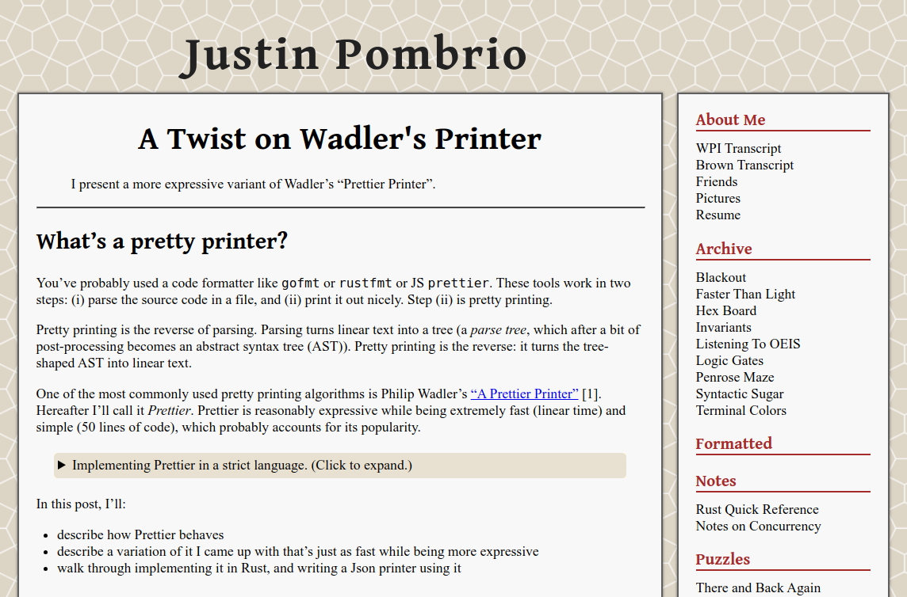

import { Image } from 'astro:assets';
import myImage from './images/blog-pombrio.png'; // Image is 1600x900

# Favorite Blogs

### Functional Programming & Programming Language Theory

* [Joachim Breitner's Blog](https://www.joachim-breitner.de/blog)
* [cgrad.ski](https://cgad.ski/) by Christopher Gadzinski
  * ["Where is Noether's Principle in Machine Learning?"](https://cgad.ski/blog/where-is-noethers-principle-in-machine-learning.html)
* [Hey There Buddo!](https://www.philipzucker.com/) by Philip Zucker
* [Well-Typed Reflextions](https://lptk.github.io/) by Lionel Parreaux
* [mazzo.li](https://mazzo.li/archive.html) by Francesco Mazzoli
  * [Lanczos Interpolation Explained](https://www.jeremykun.com/2013/11/30/lagrangians-for-the-amnesiac/)
* [Blog](https://jesper.sikanda.be/blog.html) by Jesper Cockx
* [Ben Lynn's Blog](https://crypto.stanford.edu/~blynn/compiler/)
* [Daniel Fedorin's Blog](https://danilafe.com/blog)
  * ["Microfeatures I Love in Blogs and Personal Websites"](https://danilafe.com/blog/blog_microfeatures/)
  * ["Bergamot:  Exploring Programming Language Inference Rules"](https://danilafe.com/blog/bergamot/)
* [Chapel Language Blog](https://chapel-lang.org/blog/)
  * ["Generic Linear Multistep Method Evaluator using Chapel"](https://chapel-lang.org/blog/posts/linear-multistep/)
* [Iago Leal's Blog](https://iagoleal.com)
  * [Recursion Schemes for Mathematicians](https://iagoleal.com/posts/recursion-schemes/)
  * [Playing with Value Iteration in Haskell](https://iagoleal.com/posts/value-iteration-haskell/)
  * [Algebraic Path Finding](https://iagoleal.com/posts/algebraic-path/)
* [Neugierig Tech Notes](https://neugierig.org/software/blog)
  * [ICFP 2024 Programming Contest](https://neugierig.org/software/blog/2024/07/icfp-2024.html)
* [Eighty-Twenty](https://eighty-twenty.org/)
  * [More pitfalls regarding JavaScript's non-monadic promises](https://eighty-twenty.org/2024/01/24/more-pitfalls-of-js-promises)

### [Justin Pombrio's Blog](https://justinpombrio.net/)

* [A Twist on Wadler's Printer](https://justinpombrio.net/2024/02/23/a-twist-on-Wadlers-printer.html)
* [Algebra and Data Types](https://justinpombrio.net/2021/03/11/algebra-and-data-types.html)

### Programming & Software Engineering

* [Project Nayuki](https://www.nayuki.io/)
* [Math ∩ Programming](https://www.jeremykun.com/) by Jeremy Kun
  * ["Tensorphobia and the Outer Product"](https://www.jeremykun.com/2016/03/28/tensorphobia-outer-product/)
  * ["Lagrangians for the Amnesiac"](https://www.jeremykun.com/2013/11/30/lagrangians-for-the-amnesiac/)
* [Eric Zhang's Blog](https://www.ekzhang.com/projects)
* [Lj Miranda's Blog](https://ljvmiranda921.github.io/)

### Graphics & Visualization

* [ciechanow.ski](https://ciechanow.ski/) by Bartosz Ciechanowski
  * [airfoil](https://ciechanow.ski/)
* [osar.fr](https://www.osar.fr/) by Pierre Cusa
  * [motion blur](https://www.osar.fr/notes/motionblur/)
	* [log-spherical mapping](https://www.osar.fr/notes/logspherical/)
* [Game Art Tricks](http://simonschreibt.de/game-art-tricks/) by Simon Schreibt
* [Alex Harri's Blog](https://alexharri.com/blog/planes)
* Jasmcole, ["Helmhurts"](https://jasmcole.com/2014/08/25/helmhurts/)
* Daniel Sieger's Blog
  * [Generating Meshes of a Sphere](https://danielsieger.com/blog/2021/03/27/generating-spheres.html)

### Game Development

* byMuno, [Rollback Netcode](https://bymuno.com/post/rollback)
* [Erik Onarheim's Blog](https://erikonarheim.com/posts/)
* Elias Daler, [How I Learned Vulkan and wrote a small game engine in it](https://edw.is/learning-vulkan/)
* Carmen Cincotti, [Carmen's Graphics Blog](https://carmencincotti.com/2022-07-11/position-based-dynamics/)
  * [Position-Based Dynamics](https://carmencincotti.com/2022-07-11/position-based-dynamics/)

### Frontend Development

### Miscellaneous

[neal.fun](https://neal.fun/) by Neal