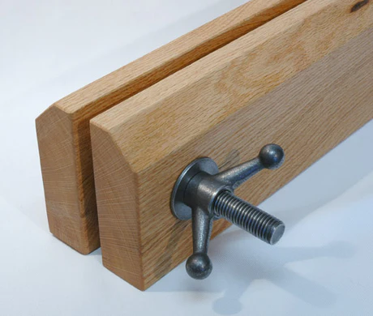
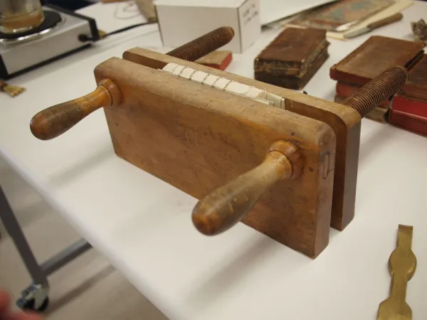
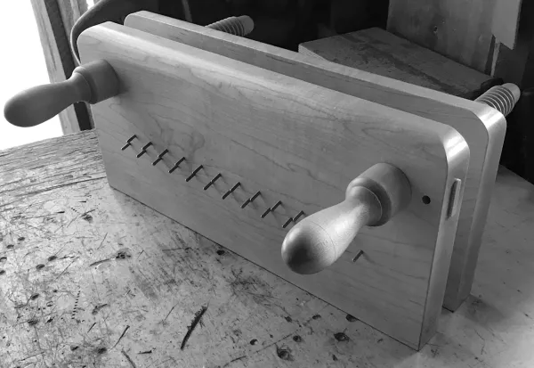

<LongQuote>
## [Finishing Press](https://affordablebindingequipment.com/bookbinding-finishing-press/) by `AffordableBindingEquipment`

</LongQuote>

<LongQuote>
## Hollanders [Finishing Press](https://hollanders.com/products/finishing-press-red-oak?variant=30314102685750)

Measurements
* 5.5in H x 20 L
* 14in W (space between metal screws)
* 3in between open jaws
* jaws are red oak, 1.75in thick
* tapered at the top to 35 degree beveled edges
* 8" 3/4-10 threaded rods, 3/4in nuts and washers, 4.5in cast metal handles
* danish oil

</LongQuote>

<LongQuote>
## [Cincinnati Press](https://jeffpeachey.com/tag/finishing-press-for-bookbinding/) via Jeff Peachey

</LongQuote>