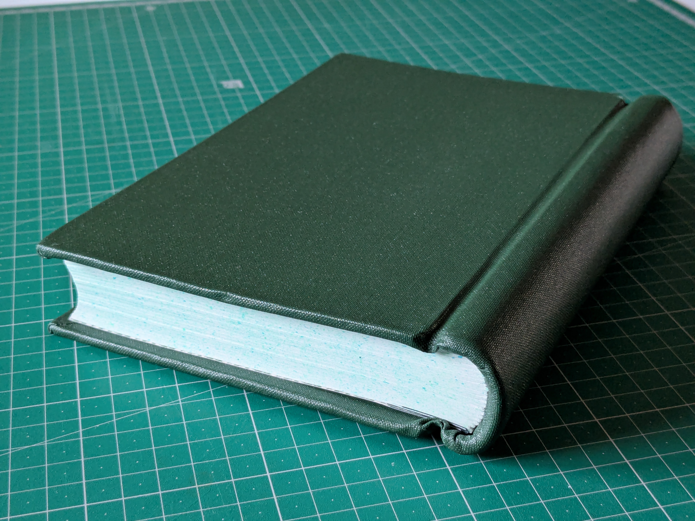
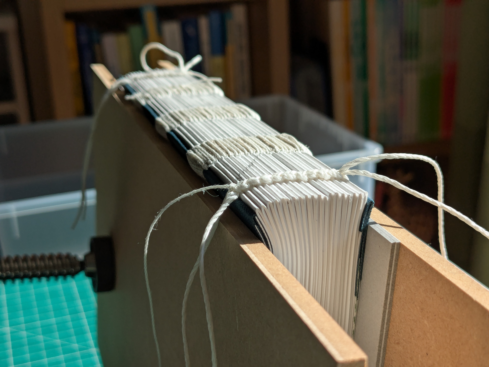
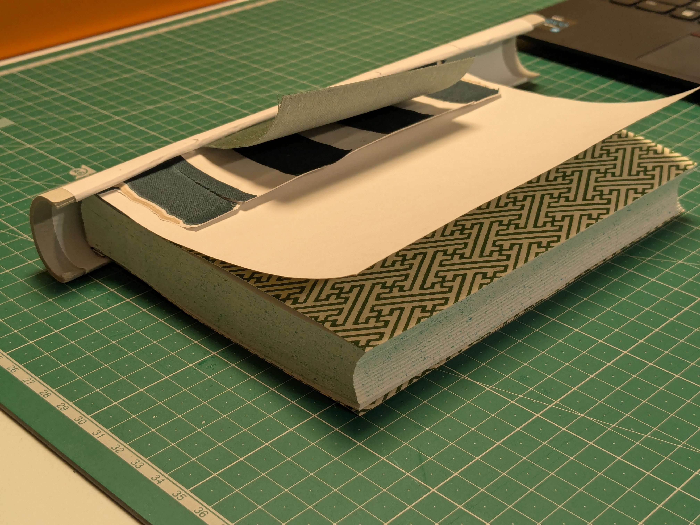
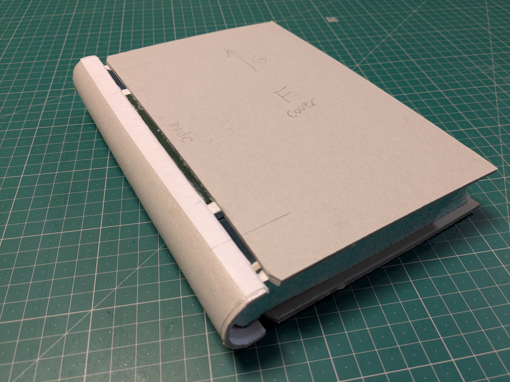
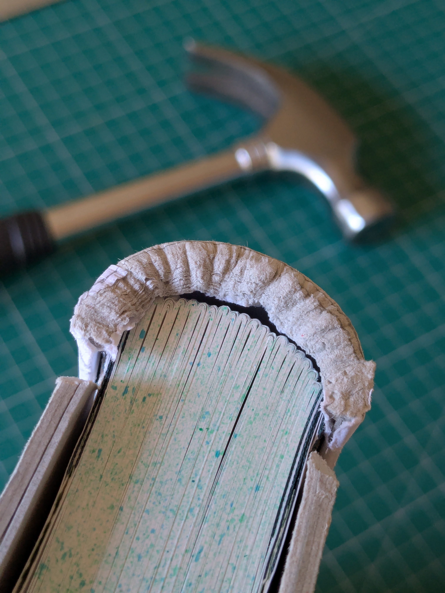
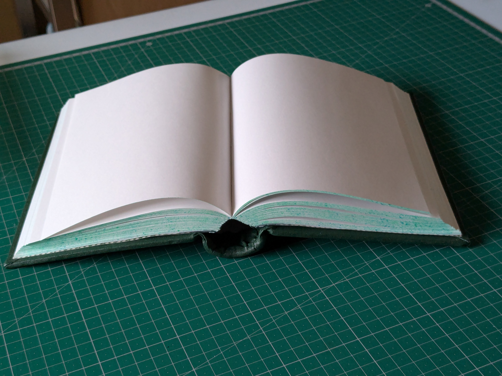
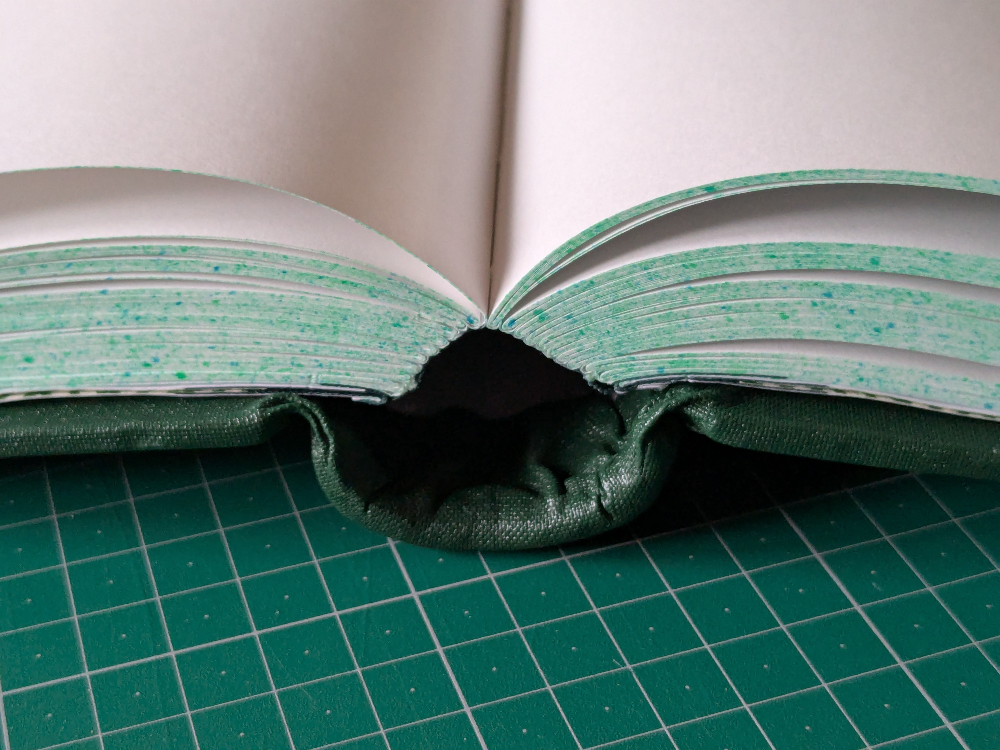

## Result

## Process

* Cut long-grain A3 paper into short-grain A4 sheets, yielding long-grain A5 when folded in half
* 19 signatures of 6 sheets each
* Three 20mm linen tapes as sewing supports
* Split boards (1mm inner + 2mm outer long-grain grayboard, glued to two-thirds of cover width)
* For spring, measured 2mm-thick grayboard wide enough to extend 5mm onto lever on both sides
  - Moistened and molded around 32mm dowel, left to dry 10 min.
  - Then, glued 20% cotton paper on spring interior, wrapping 10mm around both sides to the exterior.  This paper will be visible when the book opens.
  - Once again wrapped spring tightly around dowel and let dry 1-2 hours.
  - Used figers & ruler to gently flatten spring from a circular arc into a C-shaped clamp to fit snugly around the spine of the book.
  - After doing a test fit, left to dry 24 hours with two bricks pressed firmly on either side to prevent spring from losing its shape.
  - (Note:  The spring shrunk quite significantly after drying.)
* 

## Endpapers

## Reinforced Kettle Stitch

## Forming the Spring

## Spring & Cover Assembly

