In a recent [Hahns Atelier video](https://www.youtube.com/watch?v=nthH5IqAFk0), Hahn crafted a fish-shaped leather coin purse by wet-molding leather in a *bungeo-ppang* (in Japanese, *taiyaki*) mold.  I loved the idea and repeated his process myself to make a leather dice pouch for D&D!

## Final Result

## Harvesting Leather

I carefully disassembled a cheap sheep-leather jacket from a local thrift store.  Aside from the leather itself, I was able to salvage five zippers as well as portions of the jacket lining.

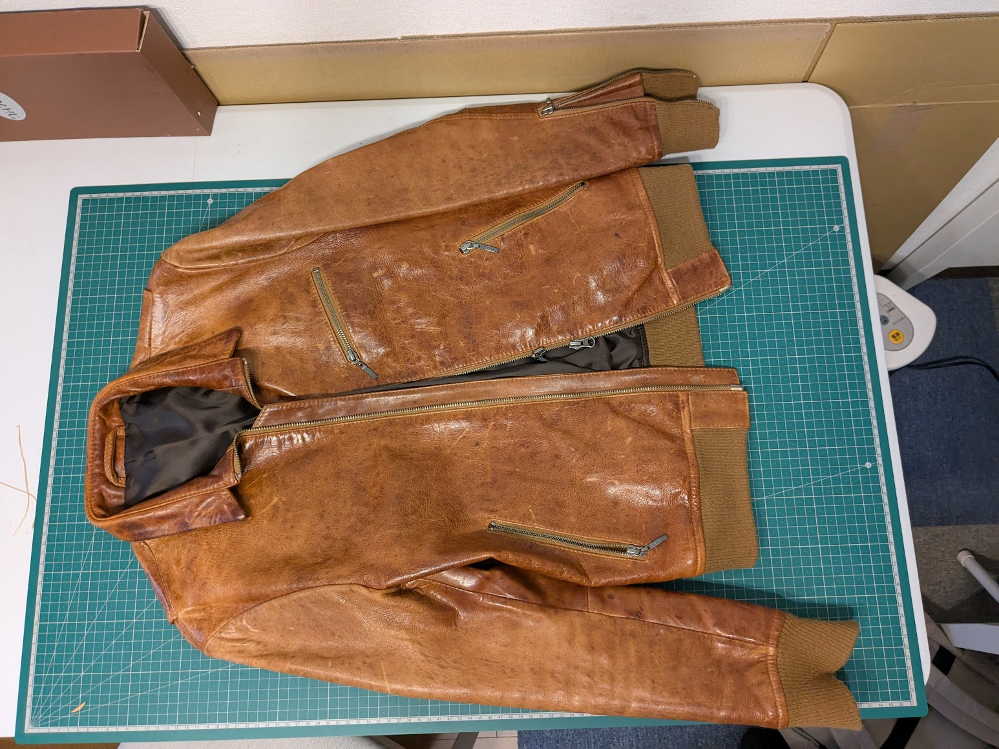
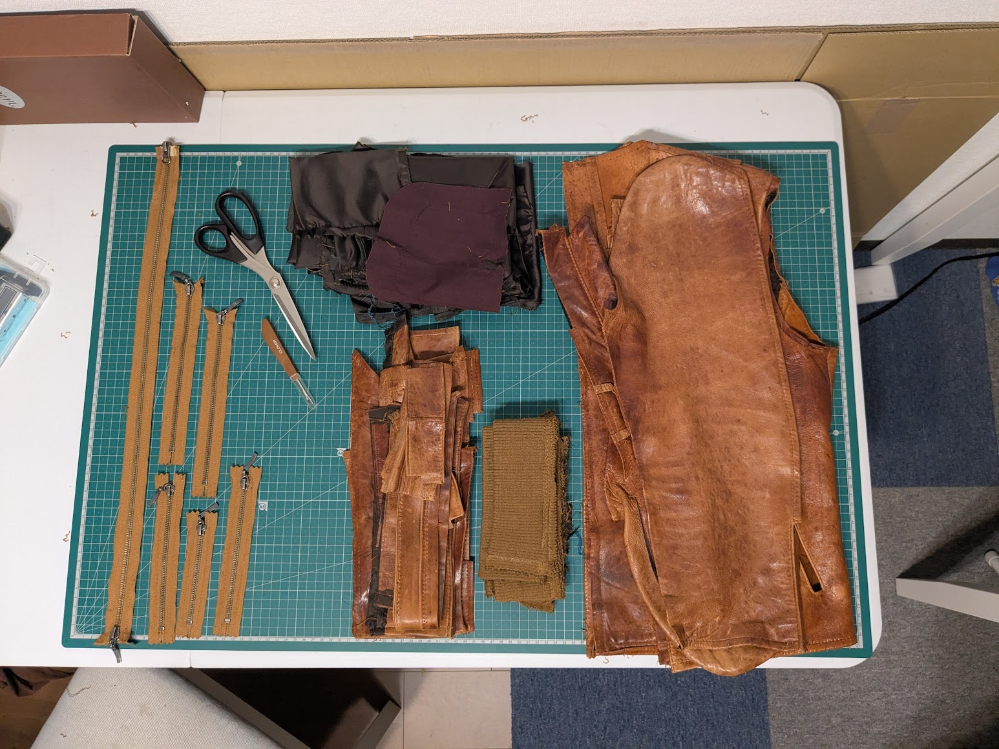

## Wet-Molding

Like Hahn, I produced a silicone inner mold of the taiyaki press to help squeeze the leather against the outer metal press.  Each side of the pouch is formed by squeezing two sheets of wet leather between the silicone and the metal.

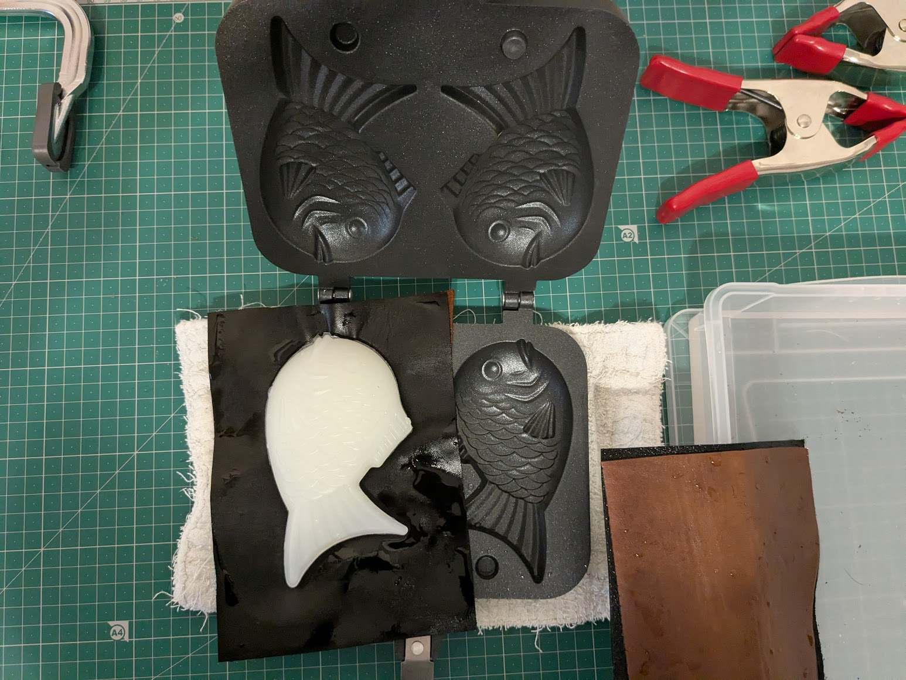
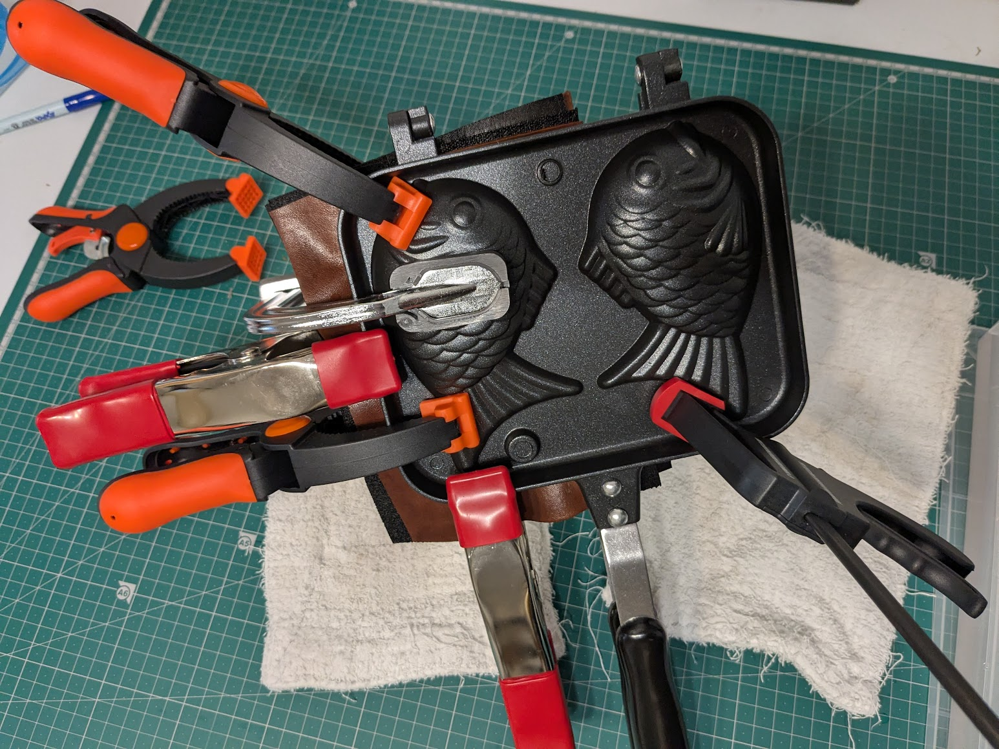

The initial impression left by the mold was very detailed, but unfortunately it lost definition over time.

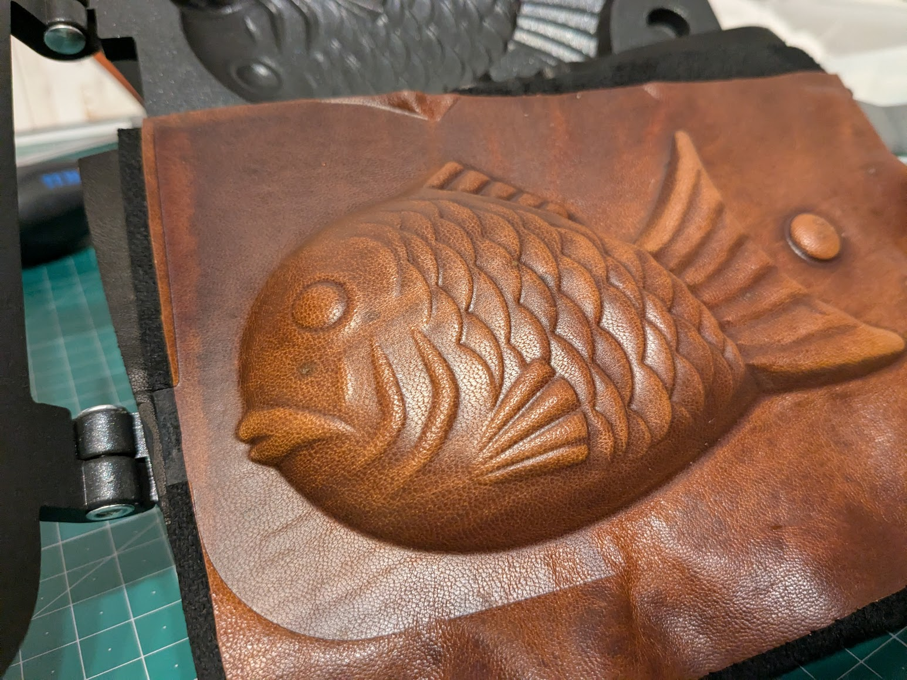
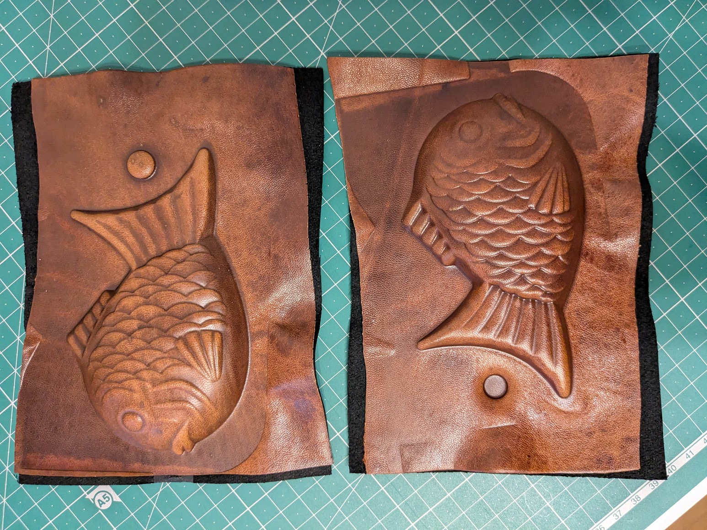

## Trimming

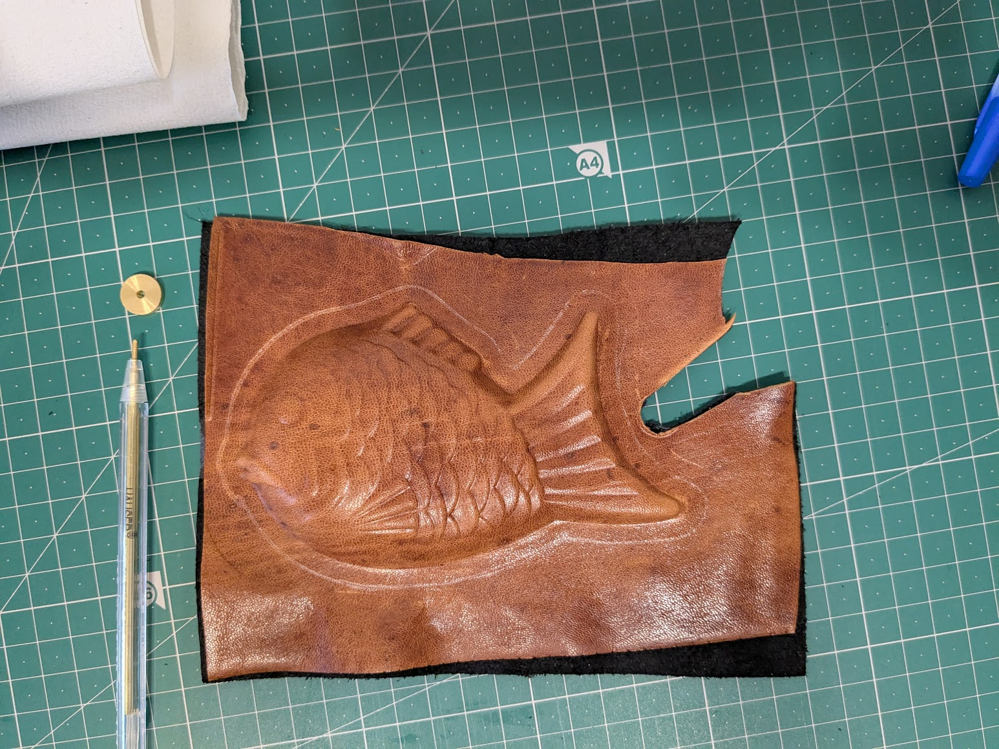
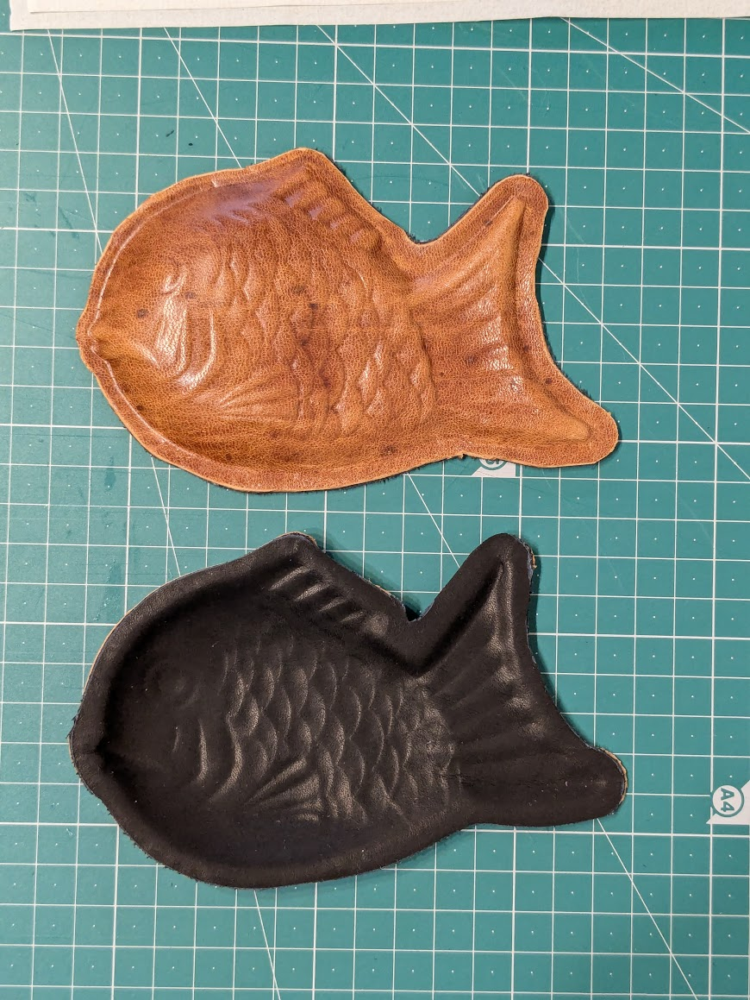

## Punching Holes

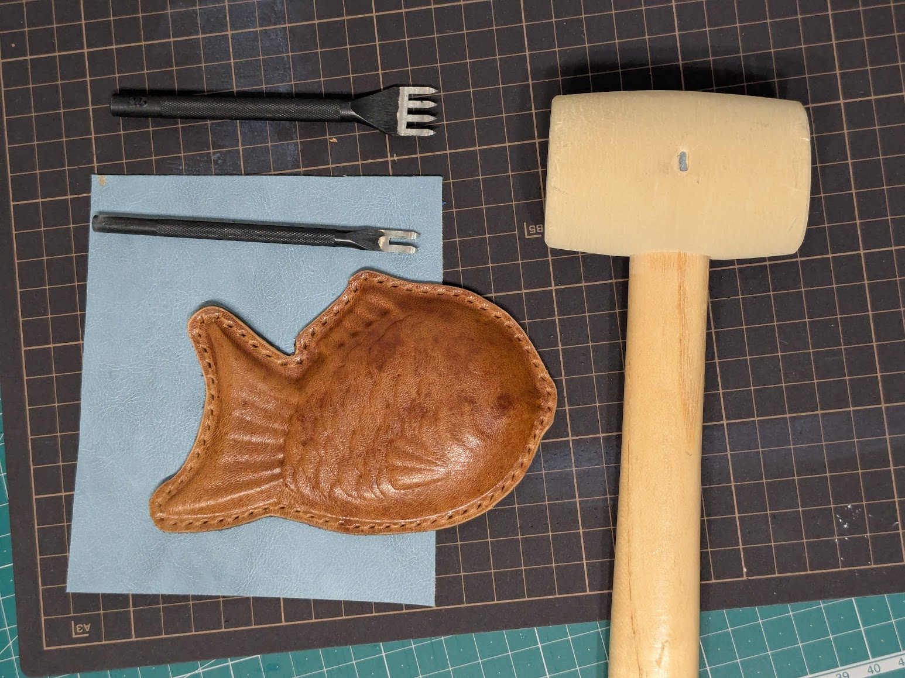

## Attaching the Zipper

The zipper is from a pocket of the same jacket I sourced the leather from!

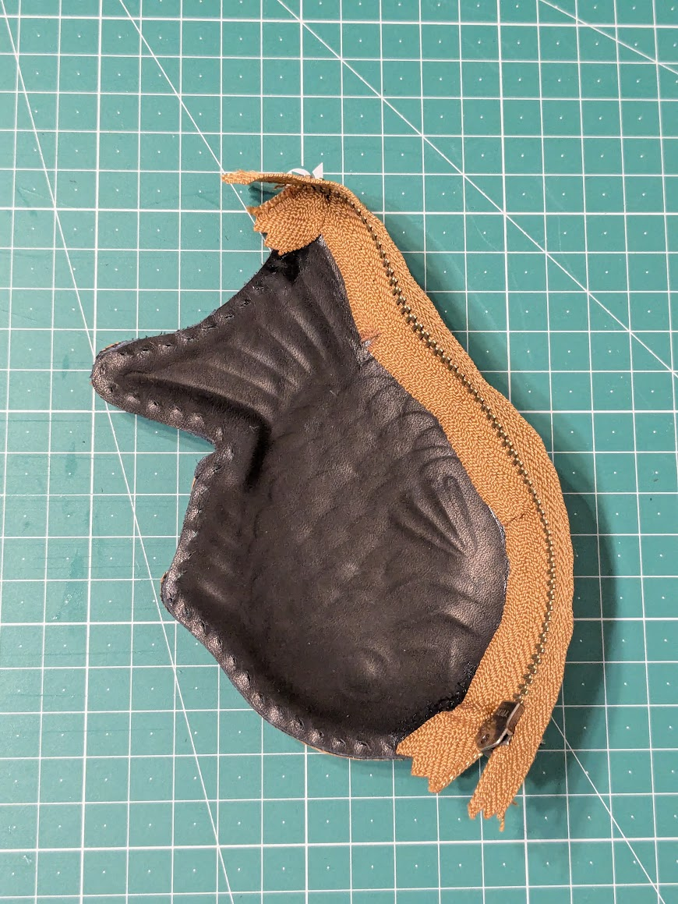
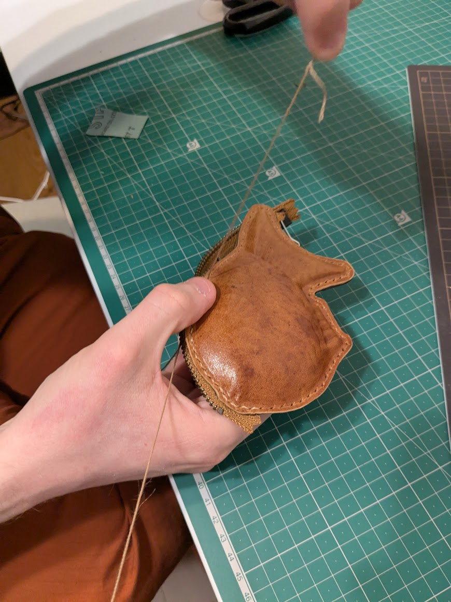
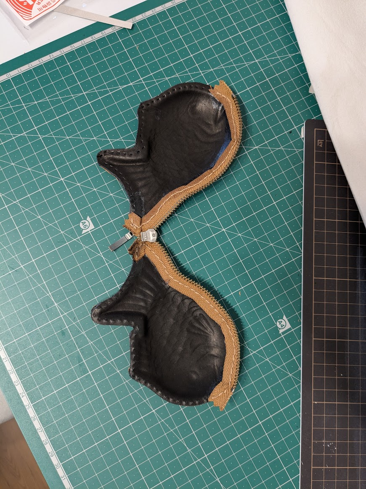

I tried melting the ends of the thread to close the seam, but this only charred the zipper, oops!  I set aside the lighter and applied a dab of glue instead to secure the ends.

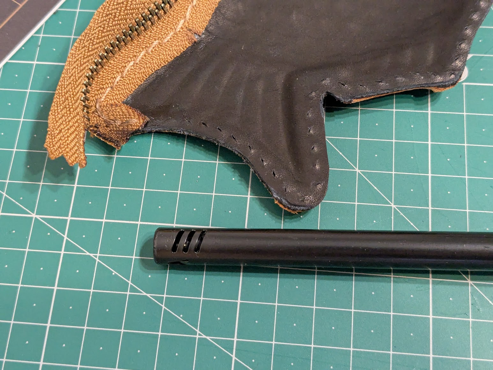

## Sewing the Top

I used needles to align the stitch holes along the top ridge of the fish while gluing the two sides together, then completed the final stitch.

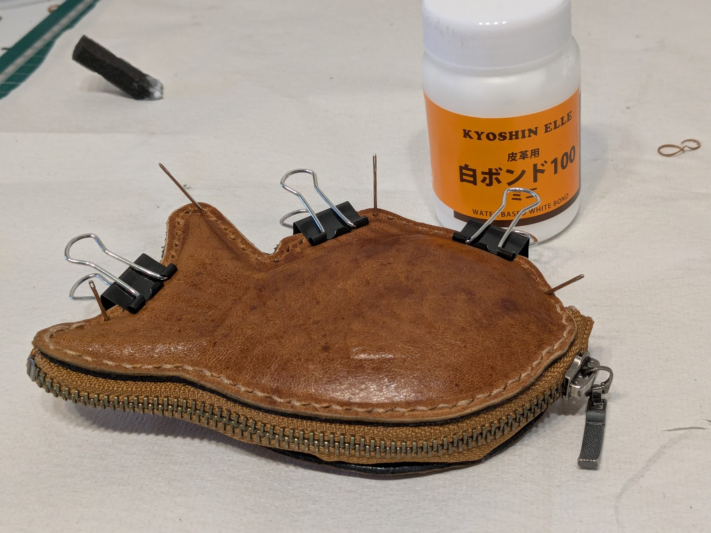

## Challenges & Future Improvements

* The wet-molded leather didn't keep its shape as well as I had hoped.  The initial impression left by the mold was very detailed, but as I worked the leather the details slowly faded.  I'm curious if this can be improved by changing my process, or if it's due to the specific materials I'm using.  Hahn appeared to use stiffer leather, so perhaps I'll try that next.

* I wasn't quite sure how to nicely hide the excess fabric at each end of the zipper.  On one end I succeeded in tucking it away inside the pouch and securing with a stitch, but doing so on the other end created too many extra layers that were difficult to manage.  I ended up trimming a bit off, but it doesn't look quite as neat as I'd have liked.

* Alignment is hard!  The fish definitely has a good and a bad side.