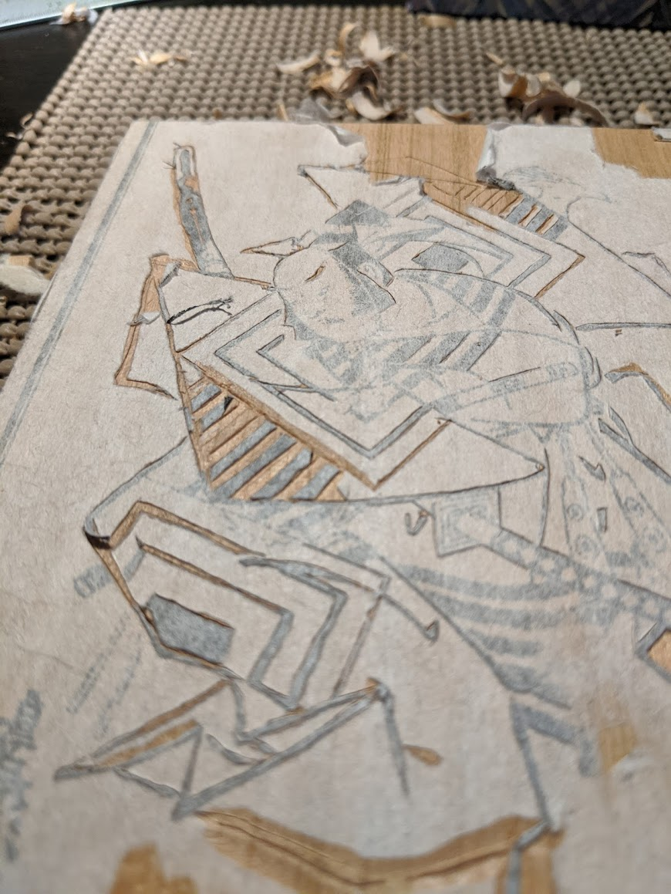

After coming home from an internship in Tokyo during the summer of 2019, I briefly took up woodblock printmaking as a way to stay connected with Japan until I could return!

## Mokuhankan

While in Tokyo, I signed up for one of David Bull's printmaking demonstrations at the [*Mokuhankan*](https://mokuhankan.com/asakusa/index.html) shop in Asakusa, where he guides visitors through the printing process using a simplified version of Hokusai's *Great Wave*.  

I had a wonderful time and left eager to try it myself!  Guided by David's [YouTube channel](https://www.youtube.com/@seseragistudio/videos) and armed with a set of basic carving knives from Sekaido, I took to carving!

## King of Diamonds

One of my first real prints.  I was still getting the hang of carving, and the finer details proved to be a challenge.  This was also my first attempt carving registration marks to align the different layers of multi-color prints.

## Kabuki #1

Next, I wanted to practice carving fine details.  I searched online for a suitable image and found a very old (circa 1705-1710) print by Okamura Masanobu titled [*Yakusha ezukushi Pl. 11*](https://artvee.com/dl/yakusha-ezukushi-pl-11#00).

While I was writing this, I couldn't quite remember the original title or artist, but it turns out Google reverse image search is good enough to find an exact match based on a blurry photo of my print.  Magic!

## Kabuki #2

I tried a few different methods for transferring images to the wood for carving.  I started on another kabuki image but stopped halfway when the transfer paper peeled off during carving:

## Catfishing

Another image cropped from an existing print.  This time, the ink transferred quite well from the washi paper to the board.  I remember using some kind of transparent marker to release the ink from the paper.

It took a while to learn how much ink to use and where to apply pressure with the baren:

