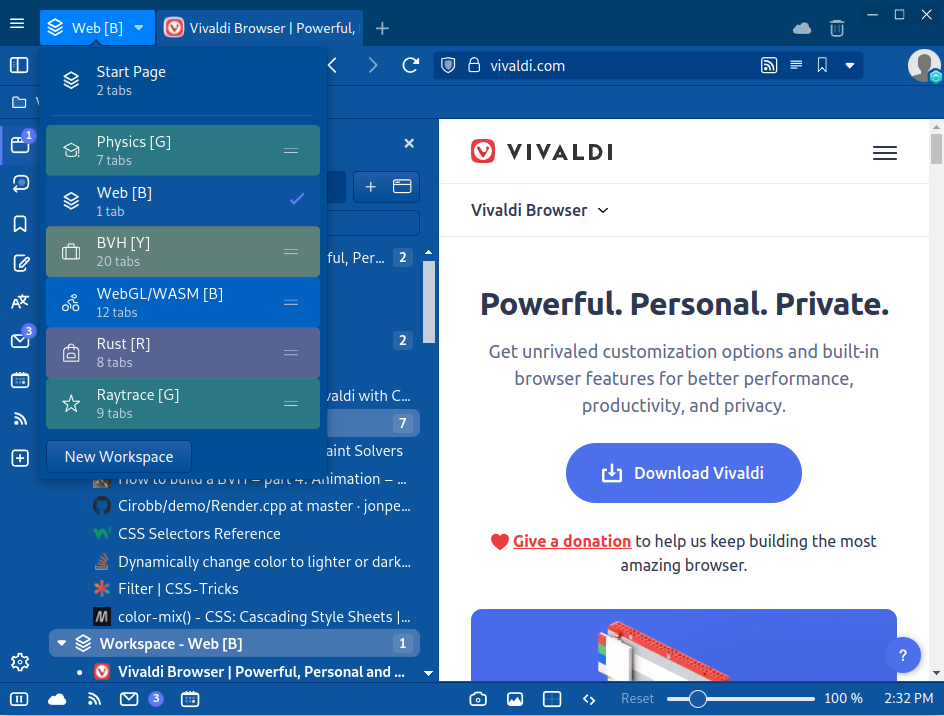

Chrome has been my default browser for more than ten years, but I recently switched to [Vivaldi](https://vivaldi.com) and don't plan to ever look back.  Compared to Chrome, Vivaldi offers:

* built-in RSS, Calendar, Email integrations
* a searchable [Command Palette](https://help.vivaldi.com/desktop/shortcuts/quick-commands/)
* an integrated adblocker
* a comprehensive settings menu offering complete control over Vivaldi's behavior
* more tools for managing tabs ([Workspaces](https://vivaldi.com/features/workspaces/), [Tab Stacks](https://help.vivaldi.com/desktop/tabs/tab-stacks/), and [Sessions](https://help.vivaldi.com/desktop/tabs/session-management/))
* settings to increase information density in the user interface
* support for UI modifications with custom CSS and JavaScript

## Result



## Enabling CSS Customization in Vivaldi

## Opening Vivaldi's Developer Tools

vivaldi://inspect/#pages
vivaldi://inspect/#apps

## Customizing Workspace Colors

```css
:root {
	--workspace-bg-r: oklch(70% 0.1 17.64);
	--workspace-bg-o: oklch(70% 0.138 61.335);
	--workspace-bg-y: rgb(236.18, 202.63, 58.48);
	--workspace-bg-g: oklch(70% 0.138 142.875);
	--workspace-bg-b: oklch(61.7% 0.225 254.475);
	--workspace-bg-i: oklch(70% 0.1 192.375);
	--workspace-bg-v: rgb(140.28, 87.29, 208.38);
}

button[title~="[R]"] { --workspace-bg: var(--workspace-bg-r); }
button[title~="[O]"] { --workspace-bg: var(--workspace-bg-o); }
button[title~="[Y]"] { --workspace-bg: var(--workspace-bg-y); }
button[title~="[G]"] { --workspace-bg: var(--workspace-bg-g); }
button[title~="[B]"] { --workspace-bg: var(--workspace-bg-b); }
button[title~="[I]"] { --workspace-bg: var(--workspace-bg-i); }
button[title~="[V]"] { --workspace-bg: var(--workspace-bg-v); }

.button-toolbar.tabbar-workspace-button > button {
	background-color: var(--workspace-bg);
}

.theme-dark .WorkspacePopup-Items button.workspace-item-wrapper {
	background-color: oklch(from var(--workspace-bg) l c h / 40%);
}
.theme-dark .WorkspacePopup-Items button.workspace-item-wrapper:hover {
	background-color: oklch(from var(--workspace-bg) l c h / 100%);
}

/* OPTIONAL: Adds emphasis to Workspaces in the Window Panel.  */
/* Unfortunately, the HTML does not contain enough information */
/* to support workspace colors in the window tree.             */
.vivaldi-tree .tree-item[data-id*="workspace"] {
	background-color: color-mix(in oklab, var(--colorBg) 80%, white 20%);
	border-radius: 0.5em;
	font-weight: bold;
}
```