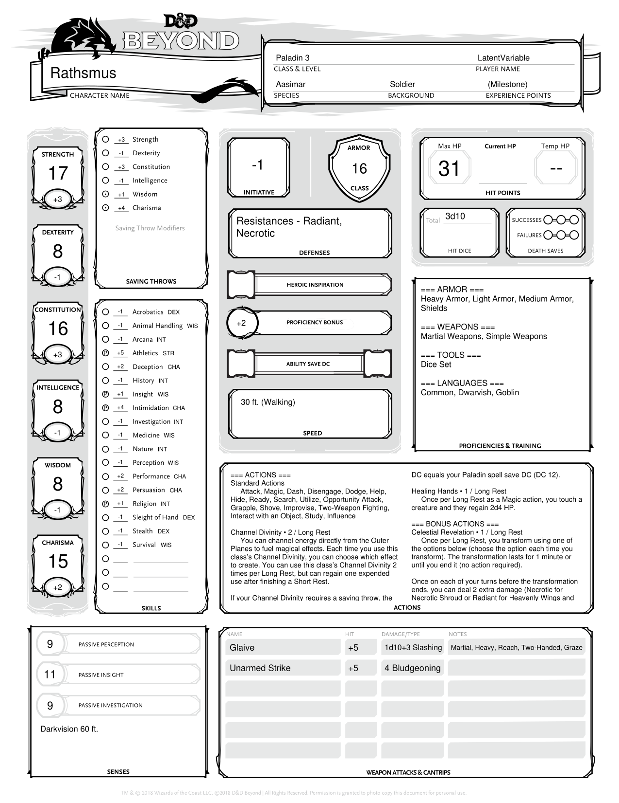
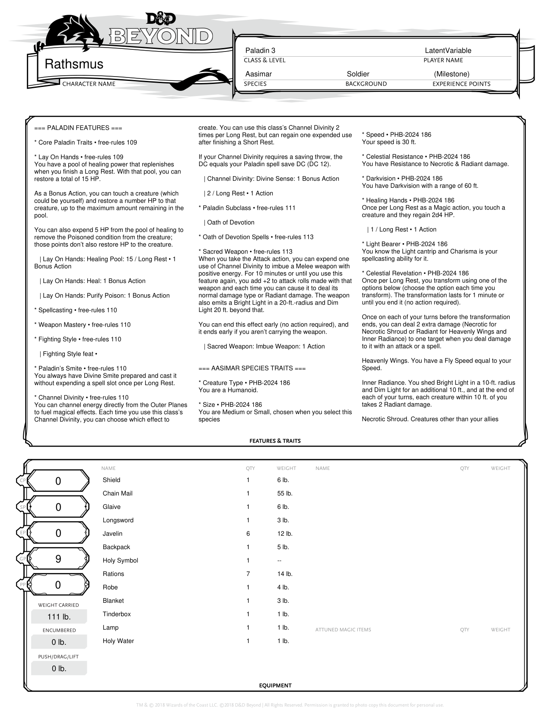
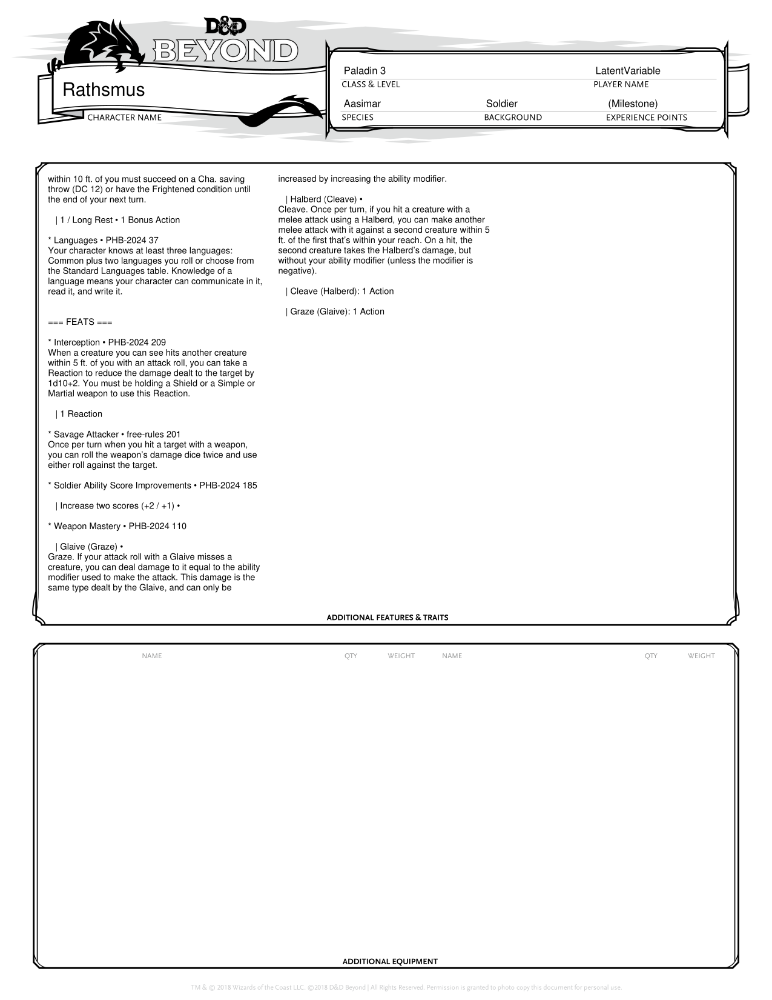
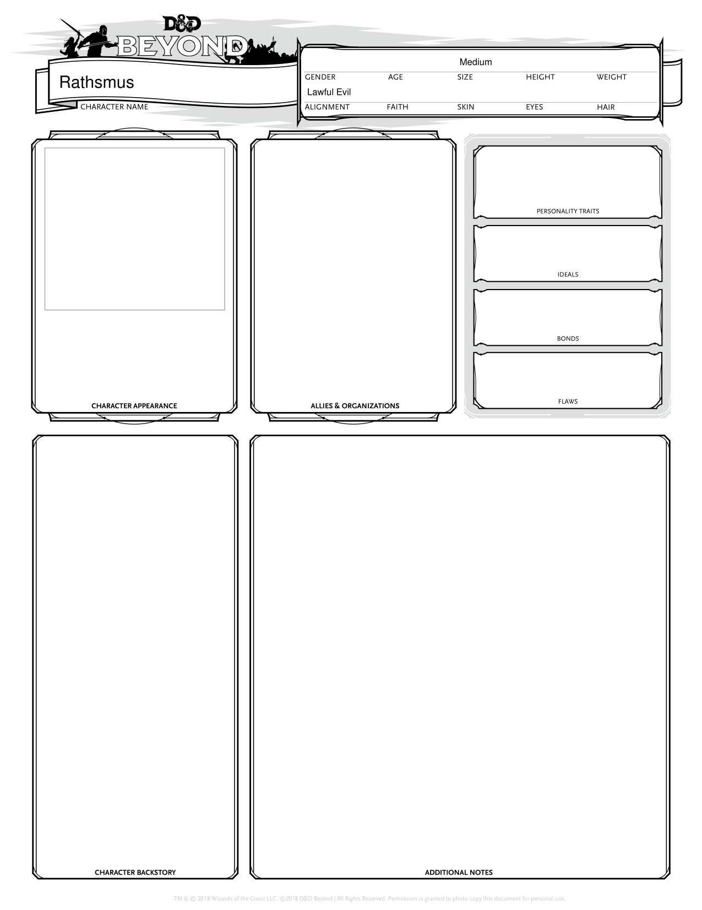
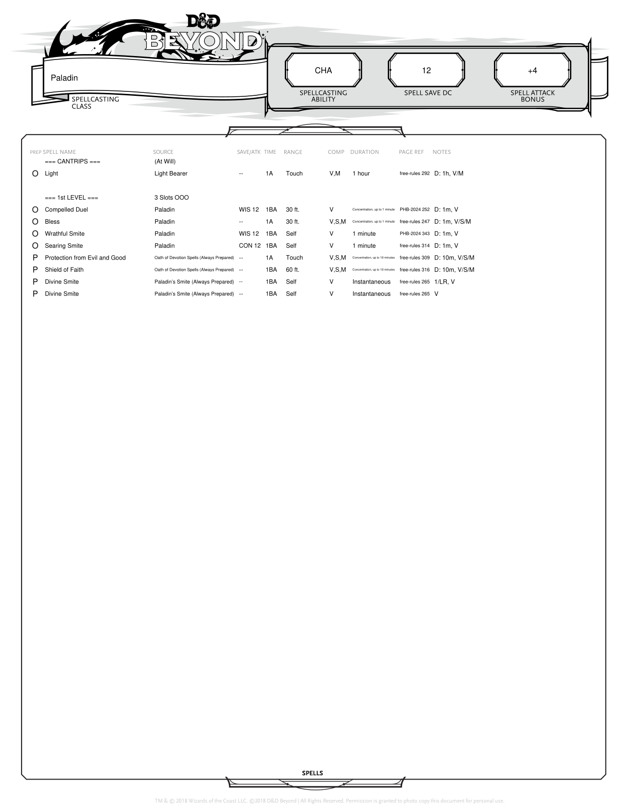

I used the Typst typesetting language to design a compact, action-oriented character sheet that automatically updates when my character levels up!

Here are a few criteria that I think make for a useful character sheet:

* A good character sheet makes it easy for the player to see which choices are available to them at any given time, based on the resources they have left.
* The most often-accessed information should appear first, and more rarely-needed minutae should be pushed to the end.

* Related stats and features should be near each other
* 
* Information that I need to refere
* Flavor text should be kept to a minimum

Here's roughly how I would rank the information on a character sheet in order of priority:

1. **Attributes, Modifiers, Saving Throws, Skills.**  Referenced frequently when making skill checks and defending from attacks.
3. **Inventory, Equipment.**  Changes infrequently, and rarely need to reference directly during combat.

Information about weapon damage dice, masteries, and other effects is most essential.
2.  **Character Name, Class, Race, Level.** Every player will know this information by heart!

# Inspiration

I drew a lot of inspiration from the design language of *Baldur's Gate 3*, in particular the radial menus on console versions of the game.  In particular, the icons for ⬤ actions, △ reactions, and ✱ bonus actions

# Shortcomings of *D&D Beyond* Character Sheets

Since I manage my character as part of my party's D&D Beyond campaign, for a while I used the official PDF character sheets.  Here are the first two pages:

These are the first _two of five_ pages 

For a while, I kept trackThe character sheets generated by the official *D&D Beyond* tool look like this:

All the information is present, but it's 
This layout has a number of issues during combat:

* The sheet layout does not 
* There is a gluttony of blank space and padding
* Crucial stats like Spell Save DC and Spell Attack Bonus are buried all the way on page 5!

# Introduction to Typst

**Typst** is a programming language for typesetting documents.  Like LaTeX, but with modern language features.

# Final Result

# References

* Justin Pombrio 2024, [Typst as a Language](https://justinpombrio.net/2024/11/30/typst.html)