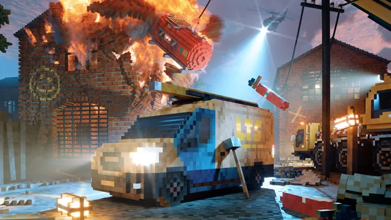

import PostContent from "@components/blog/PostContent.astro";
import SeriesSummary from "@components/content/SeriesSummary.astro";

This series offers a complete, self-contained guide to implementing a basic two-dimensional physics solver.  We cover the necessary mathematical concepts and describe the solver architecture at a high-level before diving into a concrete implementation in Rust.

I grew up playing physics-based Flash games like _Crush the Castle_, [_The Gun Game_](https://armorgames.com/play/4794/the-gun-game), _Super Stacker_, or _Sushi Cat_.  I spent hours upon hours carefully arranging entire villages in the _Crysis_ Sandbox Editor before abruptly detonating them.  In _Splinter Cell: Chaos Theory_, I still remember the thrill of spotting an enemy with my thermal-vision goggles through a canvas tent and discovering that I could use my knife carve my own hole for sneaking through.

Physics simulation is one way to give players an _emergent_ gameplay experience.

This series re-implements each of these games entirely from scratch!

Prerequisites:

* **Math:** I will assume that you have at least some exposure to calculus and linear algebra, but may need a refresher.  Building a game physics engine is a great way to get practice with applied math!
* **Physics:** You should have a basic understanding of concepts like velocity, acceleration, force, angular momentum, etc..
* **Programming:** Code samples will be written in Rust, but emphasis will be placed on the overall _design_ of the solver rather than specific implementation details.  I encourage you to follow along in the programming language of your choice.

Goals

* explain game physics in a modular way, making a clear distinction between *physical models* and *computational models*

<PostContent>
  <SeriesSummary />
</PostContent>

# Game Physics Primer

# Constraints

## Position-Based vs. Velocity-Based

* Rigid body simulation has traditionally used **velocity-based dynamics**, where constraint solvers can only modify object velocities. 
* Under **position-based dynamics** [@bender2017:pbd-survey], constraints are enforced by directly projecting the positions of objects, rather than indirectly through a velocity update.

## Basic Physics Loop

## Stable stacking

