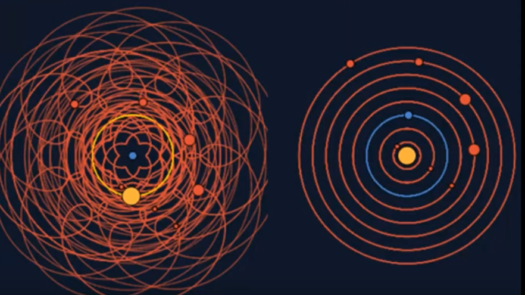

import { FigContent } from "@components/default";
import PostContent from "@components/blog/PostContent.astro";
import SeriesSummary from "@components/content/SeriesSummary.astro";

$$
\renewcommand{\vec}[1]{\mathbf{#1}}
\providecommand{\x}{\vec{x}}
\renewcommand{\v}{\vec{v}}
\renewcommand{\r}{\vec{r}}
\providecommand{\a}{\vec{a}}
\providecommand{\changed}{\color{00588c}}
$$

This series offers a complete, self-contained guide to implementing a basic two-dimensional physics solver.  We cover the necessary mathematical concepts and describe the solver architecture at a high-level before diving into a concrete implementation in Rust.

I grew up playing physics-based Flash games like _Crush the Castle_, [_The Gun Game_](https://armorgames.com/play/4794/the-gun-game), _Super Stacker_, or _Sushi Cat_.  I spent hours upon hours carefully arranging entire villages in the _Crysis_ Sandbox Editor before abruptly detonating them.  In _Splinter Cell: Chaos Theory_, I still remember the thrill of spotting an enemy with my thermal-vision goggles through a canvas tent and discovering that I could use my knife carve my own hole for sneaking through.

Physics simulation is one way to give players an _emergent_ gameplay experience.

This series re-implements each of these games entirely from scratch!

Prerequisites:

* **Math:** I will assume that you have at least some exposure to calculus and linear algebra, but may need a refresher.  Building a game physics engine is a great way to get practice with applied math!
* **Physics:** You should have a basic understanding of concepts like velocity, acceleration, force, angular momentum, etc..
* **Programming:** Code samples will be written in Rust, but emphasis will be placed on the overall _design_ of the solver rather than specific implementation details.  I encourage you to follow along in the programming language of your choice.

Goals

* explain game physics in a modular way, making a clear distinction between *physical models* and *computational models*
* equip the reader with the background necessary to read papers on more advanced game physics topics published in conferences like SIGGRAPH

<PostContent>
  <SeriesSummary />
</PostContent>

# Game Physics Primer

# Newton's Equations of Motion

The goal of modeling a physical system is to _explain_ and _predict_ how the observable state of the system changes with time.  All models are wrong, but some are useful.  We usually favor simple models which can accurately predict a wide variety of different phenomena over complex models with a narrow range of applications.

<Figure>
  <FigContent ncols={1}>
    <SubFigure>
    
    </SubFigure>
  </FigContent>
  <FigCaption>
    Geocentrism (left) vs. Heliocentrism (right).  Changing perspectives can reveal fundamental principles which explain the behavior of a system.
  </FigCaption>
</Figure>

In classical mechanics, time $t$ and position $x$ are the fundamental physical quantities that we can observe.  From the time-varying position, we can _derive_ quantities like velocity $v = \dot{x}$ and acceleration $a = \ddot{x}$, which are useful for describing the behavior of a system.

In contrast, **force** is _not_ a physical or derived quantity, but instead part of our mathematical model.  Concepts like spring force, gravitational force, buoyant force, and normal force are mathematical _abstractions_ which capture the macro-scale behavior caused by complex molecular-level interactions.  Their predictions have proven empirically to be useful.

Under this model, objects can **apply** forces to other objects.  Newton's laws describe the _effect_ that applied forces have on motion.  In particular, Newton's Second Law relates force to acceleration:

$$
\begin{aligned}
\vec{F} = \frac{d \vec{p}}{d t} = m \vec{a} && \text{(Newton's Second Law, for constant mass $m$)}
\end{aligned}
$$

It is important to understand that Newton's Second Law is _not_ a definition of force.  <ExactQuote source="wikipedia">Forces exist as separate from the acceleration produced by the force in a particular system.  The same force that is identified as producing acceleration to an object can then be applied to any other object, and the resulting accelerations will always be inversely proportional to the mass of the object.  Newton's Second Law states that all the effect of a force onto a system can be reduced to two pieces of information:  the magnitude of the force and its direction.  Given these, Newton's second law specifies what the effect will be.</ExactQuote>

### Newton's Laws

The three standard laws are:

Some additional physical principles:

* **Superposition Principle.** Forces add like vectors.
* At any instant, a body reacts to the forces applied to it at that instant (and only those forces!).

### Case Study:  Hooke's Law

One way to come up with a new force law is through empirical testing.  Hooke's law can be experimentally verified by testing different configurations of masses and displacements, using Newton's Second Law to calculate the magnitude of the force which caused the observed acceleration.

<Figure>
  <FigContent ncols={1}>
    <SubFigure>
    
    </SubFigure>
  </FigContent>
  <FigCaption>
    **Experiment.**  By compressing or extending a spring to specific displaces with different masses, we can empirically derive Hooke's Law, $\vec{F} = -k{x}$.
  </FigCaption>
</Figure>

Once we have confidence in our empirically-derived force law, we can use it to predict the behavior of more complex physical systems:

<Figure>
  <FigContent ncols={1}>
    <SubFigure>
    
    </SubFigure>
  </FigContent>
  <FigCaption>
    By understanding the forces applied by the spring and pulley individually, Newton's laws allow us to accurately predict their combined effect.
  </FigCaption>
</Figure>

## Differential Equations

Problem (Physical Simulation)
* **Input:**
  * Initial position $x_0 \in \R^2$ and velocity $v_0 \in \R^2$ of our particle.
  * A function $f(x, t)$ representing the total applied force at position $x$, time $t$
* **Output:** The complete trajectory $x(t)$ of the particle for $t \geq 0$.

# Constraints

## Position-Based vs. Velocity-Based

* Rigid body simulation has traditionally used **velocity-based dynamics**, where constraint solvers can only modify object velocities. 
* Under **position-based dynamics** [@bender2017:pbd-survey], constraints are enforced by directly projecting the positions of objects, rather than indirectly through a velocity update.

## Basic Physics Loop

## Stable stacking

# Fix Your Timestep

Non-constant timesteps can have noticeable impact on gameplay.

> The timestep naturally has to be small enough that you can get good results with values that change quickly. The simulator I worked on professionally used adaptive step size. For these applications where accuracy is paramount, the adaptive step size gets you there with a smaller computational budget. For games, you often want a very repeatable physics simulation. For example, if the player can normally jump onto a 3.5m ledge, and the step size changes, maybe the player can now jump 3.6m, or maybe only 3.4m. This can frustrate the player (or it can be exploited in speedruns).
>
> I’d also say that for most games, physical accuracy is very rarely a useful tool. That’s just my experience. 90% of the time, I just want velocity, momentum, and collisions. If you are using an existing engine like Unity, this means, among other things, that you probably don’t want to make everything in your game a Rigidbody. The physics simulator is great for things like knocking crates over and making characters ragdoll, but for your characters in-game, try doing the physics yourself in a custom character behavior instead of using Rigidbody.
>
> from [klodolph](https://news.ycombinator.com/item?id=23652436) from the (Fix Your Timestep thread](https://news.ycombinator.com/item?id=23649406)

other

* https://www.zubspace.com/blog/smooth-movement-in-unity
* we will all be game programmers / what web dev can learn from game dev https://www.youtube.com/watch?v=avwDj3KRuLc
* Jonathan Blow frame rate independence in Braid https://www.youtube.com/watch?v=fdAOPHgW7qM