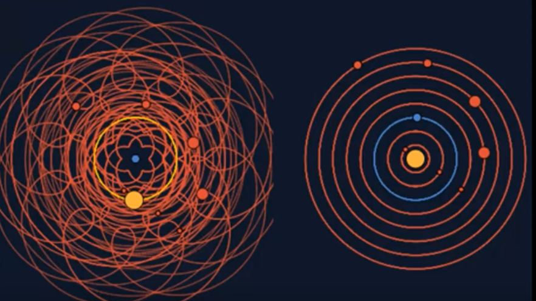

import { FigContent } from "@components/default";
import PostContent from "@components/blog/PostContent.astro";
import SeriesSummary from "@components/content/SeriesSummary.astro";

introasdfalkjsdf

<PostContent>
  <SeriesSummary />
</PostContent>

# Newton's Equations of Motion

The goal of modeling a physical system is to _explain_ and _predict_ how the observable state of the system changes with time.  All models are wrong, but some are useful.  We usually favor simple models which can accurately predict a wide variety of different phenomena over complex models with a narrow range of applications.

<Figure>
  <FigContent ncols={1}>
    <SubFigure>
    
    </SubFigure>
  </FigContent>
  <FigCaption>
    Geocentrism (left) vs. Heliocentrism (right).  Changing perspectives can reveal fundamental principles which explain the behavior of a system.
  </FigCaption>
</Figure>

In classical mechanics, time $t$ and position $x$ are the fundamental physical quantities that we can observe.  From the time-varying position, we can _derive_ quantities like velocity $v = \dot{x}$ and acceleration $a = \ddot{x}$, which are useful for describing the behavior of a system.

In contrast, **force** is _not_ a physical or derived quantity, but instead part of our mathematical model.  Concepts like spring force, graviational force, and normal force are mathematical _simplifications_ which capture the macro-scale behavior caused by complex molecular-level interactions.

Newton's Second Law declares a relationship between **total force** and **momentum**.

```typst
#import "@preview/mannot:0.2.3": *
#set page(width: auto, height: auto)
$
  markul(p_i, tag: #<p>)
  = markrect(
    exp(- marktc(beta, tag: #<beta>) marktc(E_i, tag: #<E>, color: #green)),
    tag: #<Boltzmann>, color: #blue,
  ) / mark(sum_j exp(- beta E_j), tag: #<Z>)

  #annot(<p>, pos: left)[Probability of \ state $i$]
  #annot(<beta>, pos: top + left, yshift: 2em)[Inverse temperature]
  #annot(<E>, pos: top + right, yshift: 1em)[Energy]
  #annot(<Boltzmann>, pos: top + left)[Boltzmann factor]
  #annot(<Z>)[Partition function]
$
```

$$
F = 
$$


* **Observed quantities.**
* **Derived quantities.**
* **Modeled quantities.**

From the time-varying position, we can _derive_ quantities like velocity $v = \dot{x}$ and acceleration $a = \ddot{x}$.  Force, however, is not a derived quantity, but 

The concept of **force** is a  is a modeling tool that we use to explain the 


# Impulse-Velocity vs. Force-Acceleration

> I recommend that you think of rigid body physics in terms of
impulses and velocities, rather than forces and accelerations.
Why? Friction is much better behaved at the impulse-velocity
level and it also allows us to treat resting contact in the same
way as colliding contact. -- [@tonge2013:iterative-rigid-body]