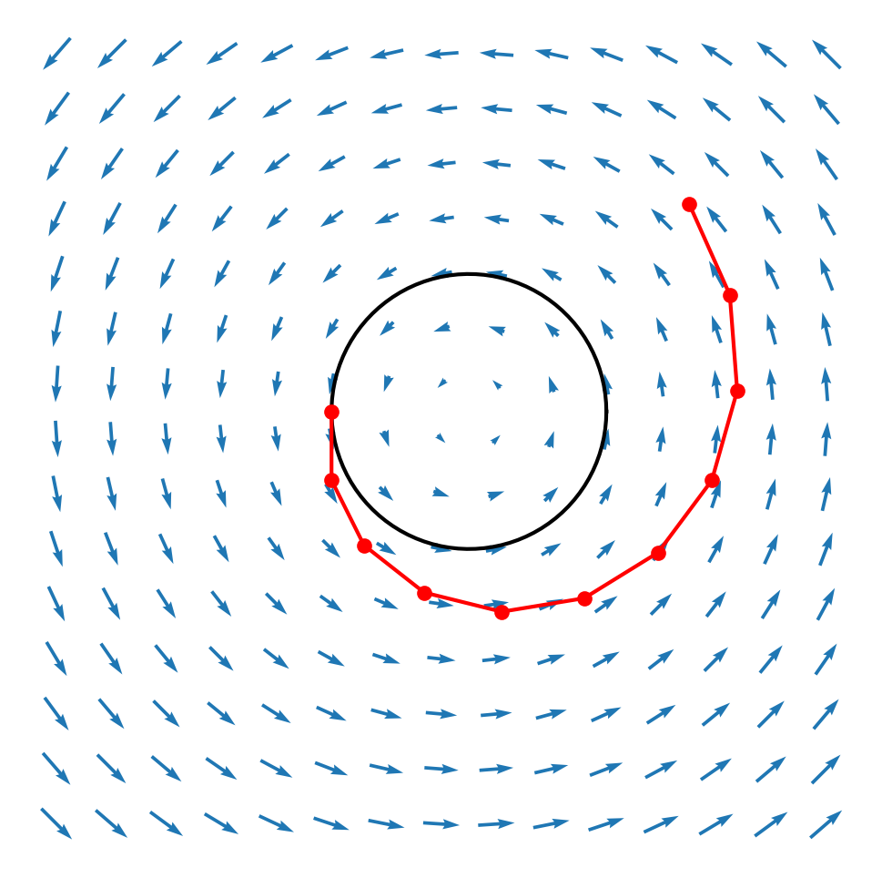

import { FigContent } from "@components/default";
import PostContent from "@components/blog/PostContent.astro";
import SeriesSummary from "@components/content/SeriesSummary.astro";

$$
\renewcommand{\vec}[1]{\mathbf{#1}}
\providecommand{\x}{\vec{x}}
\renewcommand{\v}{\vec{v}}
\renewcommand{\r}{\vec{r}}
\providecommand{\a}{\vec{a}}
\providecommand{\changed}{\color{00588c}}
$$

introasdfalkjsdf

<PostContent>
  <SeriesSummary />
</PostContent>

# Numerical Integration


## Explicit Euler

Explicit Euler Method

* first-order method (local error ~ square of step size, global error ~ step size)

* Show that explicit euler is problematic with changing acceleration (or variable timestemp?  see also [here](https://news.ycombinator.com/item?id=4934855)
* https://gamedev.stackexchange.com/questions/25300/why-is-rk4-better-than-euler-integration
## Implicit Euler
## Semi-Implicit Euler (Symplectic)
## Verlet Integration
## Velocity Verlet
## Higher-Order Schemes

Runga-Kutta

[@sauer2011:numerical]

[@bargteil2018:physics-based-animation]

StackOverflow, [What is the fundamental definition of force?](https://physics.stackexchange.com/questions/696986/what-is-the-fundamental-definition-of-force)

{/* 
```typst
#import "@preview/mannot:0.2.3": *
#set page(width: auto, height: auto, margin: 0cm)
#set text(size: 20pt)

#v(2em)
$
  markul(p_i, tag: #<p>)
  = markrect(
    exp(- marktc(beta, tag: #<beta>) marktc(E_i, tag: #<E>, color: #green)),
    tag: #<Boltzmann>, color: #blue,
  ) / mark(sum_j exp(- beta E_j), tag: #<Z>)

  #annot(<p>, pos: left)[Probability of \ state $i$]
  #annot(<beta>, pos: top + left, yshift: 2em)[Inverse temperature]
  #annot(<E>, pos: top + right, yshift: 1em)[Energy]
  #annot(<Boltzmann>, pos: top + left)[Boltzmann factor]
  #annot(<Z>)[Partition function]
$
#v(2em)
``` */}

# Systems of Differential Equations

When simulating motion caused by applied forces, we are solving the following system of differential equations:

$$
\begin{bmatrix} \dot{\x} \\ \dot{\v} \end{bmatrix}
=
\begin{bmatrix} \v \\ \frac{1}{m} \vec{f}(\x, t) \end{bmatrix}
$$

* TODO:  apply Euler's method to this system
* TODO:  apply backward euer
* TODO:  discuss verlet, leapfrog, etc
* TODO:  euler's equations of motion

# Impulse-Velocity vs. Force-Acceleration

> I recommend that you think of rigid body physics in terms of
impulses and velocities, rather than forces and accelerations.
Why? Friction is much better behaved at the impulse-velocity
level and it also allows us to treat resting contact in the same
way as colliding contact. -- [@tonge2013:iterative-rigid-body]

# Annotate Bibliography

<LongQuote>
# [@lonesock2005:time-corrected-verlet] Lonesock 2005, ["A Simple Time-Corrected Verlet Integration Method"](https://web.archive.org/web/20050206111612/http://lonesock.net/article/verlet.html)

Verlet integration is a method for integrating the equations of motion.  It comes in three flavors (Position Verlet, Velocity Verlet, and Leapfrog).  This article covers **Position Verlet**.  It has the following advantages:

* stable, even with enforced boundary conditions
* efficient to compute, like Euler integration
* 4th order accurate (unlike Euler, which is 1st order)

However:

* Verlet does not perform well with non-fixed time steps
* Requires 2 steps to get going, so initial conditions are important
* Unclear how to handle changing acceleration

This paper introduces the **Time-Corrected Verlet (TCV)** method, which minimizes the impact of the problems listed above.

$$
\begin{aligned}
x_{k+1}
  &= x_k + (x_k - x_{k-1})
  &&+ a \cdot (\Delta t)^2 & \text{(Position Verlet)} \\
x_{k+1}
  &= x_k + (x_k - x_{k-1}) \left( \tfrac{\Delta t_{k}}{\Delta t_{k-1}} \right)
  &&+ a \cdot (\Delta t_k)^2
  & \text{(Time-Corrected)}
\end{aligned}
$$

By comparison, here is the explicit Euler method (1st order) along with an unnamed second-order improvement to Euler (perhaps midpoint?):

<Figure>
  <FigContent ncols={2}>
    <SubFigure>
    $$
    \text{(Explicit Euler)} \\[0.5em]
    \begin{cases}
    v_{k+1} = v_k + a \cdot \Delta t \\
    x_{k+1} = x_k + v_{k+1} \cdot \Delta t
    \end{cases}
    $$
    </SubFigure>
    <SubFigure>
    $$
    \text{(Unknown 2nd Order Method)} \\[0.5em]
    \begin{cases}
    v_{k+1} = v_k + a \cdot \Delta t \\
    x_{k+1} = x_k + v_k \cdot \Delta t + \tfrac{1}{2} a \cdot (\Delta t)^2
    \end{cases}
    $$
    </SubFigure>
  </FigContent>
</Figure>
## Derivation of the Position Verlet Method

We are concerned with point masses, acted upon by forces.  Each frame, we calculate the force $F$ applied to the particle, and use Newton's second law $F = ma$ to compute acceleration.

Suppose we know the current position $\x_k$, velocity $\v_k$, and acceleration $\a_k$.  Under the assumption that the **acceleration is constant over the time step**, we can compute exactly where it will be after the time step $(\Delta t)$ has elapsed:

$$
\begin{aligned}
\v(t)
  &= \v_0 + \int_0^t \a \, dt
  = \v_0 + t \a \\
\x(t)
  &= \x_0 + \int_0^t \v(t) dt
  = \int_0^t \left[ \v_0 + t \a \right] dt
  = \x_0 + \v_0 t + \tfrac{1}{2} t^2 \a
\end{aligned} \\
$$

$$
\boxed{\x_{k+1} = \x_k + (\Delta t_k)\v_k + \tfrac{1}{2} (\Delta t_k)^2 \a_k}
\quad \forall k \in \N
$$

The position verlet method avoids computing the velocity $\v_k$ directly, by instead using the current and previous positions to approximate it.  Looking one step back in time,

$$
\begin{aligned}
\x_{\changed k} 
  &= \x_{\changed k-1} + (\Delta t_{\changed k-1})\v_{\changed k-1}
  + \tfrac{1}{2} (\Delta t_{\changed k-1})^2 \a_{\changed k-1} \\
{\changed \x_k - \x_{k-1}}
  &= \hphantom{\x_{k-1} +{}}
  (\Delta t_{k-1}) \v_{k-1}
  + \tfrac{1}{2} (\Delta t_{k-1})^2 \a_{k-1}
\end{aligned}
$$

Solving $\v_{k} = \v_{k-1} + (\Delta t_{k-1}) \a_{k-1}$ for $\v_{k-1}$, then substituting into the above and rearranging,

$$
\begin{aligned}
\x_k - \x_{k-1}
  &= (\Delta t_{k-1}) {\changed(\v_k - (\Delta t_{k-1}) \a_{k-1})}
  +  \tfrac{1}{2} (\Delta t_{k-1})^2 \a_{k-1} \\
(\x_k - \x_{k-1})
  + {\changed (\Delta t_{k-1})^2 \a_{k-1}}
  &= {\changed (\Delta t_{k-1}) \v_{k}}
  \hphantom{({}- (\Delta t_{k-1}) \a_{k-1})}
  +  \tfrac{1}{2} (\Delta t_{k-1})^2 \a_{k-1}
\end{aligned}
$$

Next, assuming **both the acceleration $\a$ and timestep $\Delta t$ are constant**, we have:

$$
(\x_k - \x_{k-1})
  + (\Delta t)^2 \a
  = (\Delta t) \v_{k}
  +  \tfrac{1}{2} (\Delta t)^2 \a
$$

The right-hand side of this equation matches the boxed equation from earlier!  By substituting, we arrive at the **Position Verlet** method:

$$
\text{Position Verlet} \quad 
\boxed{\x_{k+1} = \x_k + (\x_k - \x_{k-1})
  + (\Delta t)^2 \a}
$$

In summary:

* Position Verlet assumes constant acceleration (e.g. gravity).
* Position Verlet assumes a fixed time-step.

If either of these constraints is violated, error will accumulate.

* For example, friction, spring force $F = -kx$, and rigid-body constraint forces violate the constant-acceleration assumption made by Position Verlet.
* Adapting your timestep to the game's framerate will also violate the constant time-step criterion. (however, adopting the [Fix Your Timestep](https://gafferongames.com/post/fix_your_timestep/) method alleviates the need for variable-length timesteps)

All explicit integrators assume constant acceleration across the time-step, so it is hard to avoid error accumulation caused by changing acceleration.  Higher-order integrators (like RK4) aim to reduce the impact of this error, while implicit integrators (like backward Euler) relax the constant acceleration assumption.

> [...]

## Conclusion

Using the Time-Corrected form of the Verlet integration method with the proper equation for initializing the state makes the TCV integration scheme a simple, yet powerful method for doing game physics, even with changing frame rates.    It restores some of the accuracy of the method (still 4th order with constant time steps, between 2nd and 4th with changing dt), while maintaining its cheap numerical cost.  I hope this helps a bit when implementing your own physics simulation code.

</LongQuote>

<LongQuote>
# Bitterli 2009, ["Verlet-Based Approach for 2D Game Physics"](https://web.archive.org/web/20230225083542/https://www.gamedev.net/articles/programming/math-and-physics/a-verlet-based-approach-for-2d-game-physics-r2714/)
</LongQuote>

<LongQuote>
# Li 2019, ["Caltech CS 171:  Variational Integrators & Keyframe Interpolation"](https://courses.cms.caltech.edu/cs171/assignments/hw6/hw6-notes/notes-hw6.html)

* see also the assignment https://courses.cms.caltech.edu/cs171/assignments/hw6/hw6-html/cs171hw6.html

* uses the discrete Euler-Lagrange Equations to derive the symplectic euler method for a simple pendulum
</LongQuote>

{/* ---- baraff physically based modeling:  diffeqns ----------------------- */}

<LongQuote>
  # [@baraff1997:physically-based-modeling] Baraff 1997, [Physically Based Modeling:  Differential Equation Basics](https://www.cs.cmu.edu/~baraff/sigcourse/notesb.pdf)

  In an **initial value problem**, the behavior of the system is described by an ordinary differential equation of the form

  $$
  \text{Initial Value Problem} \quad
  \begin{cases}
  \dot{\x} &= f(\x, t) \\
  \x(t_0)  &= \x_0
  \end{cases}
  $$

  where $f$ is a known function, $\x$ is a vector representing the _state_ of the system, and $\dot{\x}$ is the time derivative of $\x$.  We are given the initial condition $\x(t_0) = \x$ at time $t_0$, and our goal is to solve for compute the trajectory $\x(t)$ of the system at times $t \geq t_0$.

  In two dimensions, $\x(t)$ sweeps out a curve that describes the motion of a point $\p$ in the plane.
  * At any point $\x$ and time $t$, evaluating $f(\x,t)$ yields a two-dimensional vector.  We can plot $f$ as a <span style="color:#2255cc">vector field</span>!
  * The vector located at coordinates $\x$ on the plot is the velocity that the moving point $\p$ must have if it ever passes through it!  (which it may or may not!)
  * We think of $f$ as _driving_ $\p$ from point to point, like an ocean current.
  * Wherever we initially deposit $\p$, the "current" at that point will seize it and carry it away.  All future motion is determined by $f$.
  * The trajectory swept out by $\p$ through $f$ forms an <span style="color:red">_integral curve_</span> of the vector field.

  If the derivative function $f$ depends on time, then not only the point $\p$ but also the vector field itself moves, so that $\p$\s velocity depends not only on where it is, but also on when it arrives there.

  * Like a leaf being carried away by a flowing river!

  <Figure>
    <FigContent ncols={1}>
      <SubFigure>
        
      </SubFigure>
    </FigContent>
  </Figure>

  ## Euler's Method

  Standard introductory differential equations courses focus on _symbolic_ solutions, teaching many tricks for guessing the exact, closed-form solution to differential equations with simple structure.

  Numerical methods, on the other hand, approximate the solution with a polygonal curve.  From a starting point $\x(t_0)=\x_0$, we use the derivative function $f$ to calculate an approximate movement $\Delta \x$ over a time interval $\Delta t$, using $x + \Delta x$ as our next sample point.

  * Numerical methods operate by performing one or more _derivative evaluations_ per time step.

  The simplest numerical method is **Euler's Method**, which takes a step in the direction of the derivative at each point:

  $$
  \x(t_0 + h) = \x_0 + h \dot{\x}(t_0)
  $$

  ### Accuracy, Stability, and Efficiency of Euler's Method

  Euler's method suffers from a few drawbacks:

  * **Inaccurate.** In a two-dimensional system whose integral curves are concentric circles, Euler's method will always send a point $\p$ to a cricle of larger radius, rather than maintaining orbit.
    * smaller step sizes $h$ can slow this effect, but never completely eliminate it
  * **Unstable.** In the one-dimensional system $\dot{\x} = -k\x$, we expect each point $\p$ to decay exponentially to zero.  However, for step sizes larger than $1/k$, we have $|\Delta x| > x$, so the solution oscillates about zero.  Beyond $h = 2/k$, the oscillation diverges, and the system blows up!
  * **Inefficient.**  Though Euler's method requires only one derivative evaluation per step, the step size is limited by accuracy and stability concerns.
    * Derivative calculation dominates the computational cost of most numerical methods, so it is important to choose them wisely.
    * <ExactQuote>More sophisticated methods, even some requiring as many as four or five evaluations per step, can greatly outperform Euler's method because their higher cost per step is offset by the larger stepsizes they allow.</ExactQuote>

  <Figure>
    <FigContent ncols={1}>
      <SubFigure>
        
      </SubFigure>
    </FigContent>
  </Figure>


  ### Error Analysis of Euler's Method

  To understand how Euler's method can be improved, it will be helpful to be able to quantify what we mean for a numerical method to be **accurate** and **stable**.  Assuming $\x(t)$ is smooth, we can express its value $\x(t_0 + h)$ at the end of the time step as a _Taylor Series_:

  $$
  \begin{aligned}
  \x(t_0 + h)
    &= \x(t_0)
    + h \dot{x}(t_0)
    + \frac{h^2}{2} \ddot{\x}(t_0)
    + \cdots
    + \frac{h^n}{n!} \frac{\partial^n \x}{\partial t^n} + \dots \\
    &\approx \x(t_0)
    + h \dot{x}(t_0)
    + O(h^2)
  \end{aligned}
  $$

  Euler's update formula is obtained by _truncating_ the series.
  * discarding all but the first two terms on the right side
  * Euler's method would be correct only if all derivatives beyond the first are zero, i.e. if $\x(t)$ were a linear function

  Notice the **error** or **residual** is dominated by the leading term, $(h^2/2) \ddot{x}(t)$.

  $$
  \begin{aligned}
  \r(t)
    &= \x(t_0 + h)
    - \left[ \x(t_0) + h \dot{x}(t_0) \right] \\
    &= \frac{h^2}{2} \ddot{\x}(t_0)
    + \cdots
    + \frac{h^n}{n!} \frac{\partial^n \x}{\partial t^n} + \dots
  \end{aligned}
  $$

  * We can describe the error as $O(h^2)$, ("order $h$ squared").
  * Halving the step size $h \rightarrow \tfrac{h}{2}$ results in one-quarter the error $r \rightarrow r/4$, but requires twice as many steps to cover the same distance.

  ## Midpoint Method

  Here is the update formula for the **Midpoint Method**:

  1. **Compute an Euler step.**
    $$
    \Delta \x = \Delta t \cdot \f (\x, t)
    $$
  2. **Evaluate $\f$ at the midpoint.**
    $$
    \f_{\mathrm{mid}} = \f\left( \frac{x+\Delta x}{2}, \frac{t + \Delta t}{2} \right)
    $$
  3. **Take a step using the midpoint value.**
    $$
    \x(t+\Delta t) \gets \x(t) + \Delta t \cdot \f_{\mathrm{mid}}
    $$

  ### Derivation of the Midpoint Method

  rough sketch

  * assume $f$ depends on time only indirectly through $x$, so that $\dot{\x} = f(\x(t))$.  Then,
    $$
    \ddot{x} = \frac{\partial f}{\partial \x} \dot{\x} = f' f
    $$
  * to avoid computing $f'$, which might be complicated/expensive, use a Taylor approximation of $f$ at $x_0$ with $\Delta \x = \tfrac{h}{2} f(x_0)$
  * doing so leads to the midpoint method

  ### Properties of Midpoint Method

  * midpoint method is "second-order" method, meaning error $O(h^3)$
  * however, it requires two more evaluations of $f$
  * (optional) Runge-Kutta methods achieve even higher order accuracy, at the cost of more evaluations of $f$

  ## Conclusion

  * next, the article very briefly touches on the **adaptive stepsize Euler method**, but the explanation is not detailed enough
  * finally, a discussion of **implementation**
    * solvers operate on $f(\x, t)$ as a black box
    * modular design makes it easy to swap solvers in and out, solve multiple ODEs at once, etc.
</LongQuote>


{/* ---- baraff physically based modeling:  diffeqns ----------------------- */}

<LongQuote>
  # [@baraff1997:physically-based-modeling] Baraff 1997, [Physically Based Modeling:  Implicit Methods for Differential Equations](https://www.cs.cmu.edu/~baraff/sigcourse/notese.pdf)

  managing stiff equations:
  * if possible, reformulate the problem to avoid stiffness altogether
  * otherwise, use an implicit method

  ### Example Stiff ODE

  Models the case where a particle is strongly attracted to the line $y=0$, and less strongly towards $x=0$.  Far enough forward in time, the solution should always converge to $(0,0)$.
  $$
  \dot{\x}(t)
  = \frac{d}{dt} \begin{bmatrix} x(t) \\ y(t) \end{bmatrix}
  = \begin{bmatrix} -x(t) \\ -ky(t) \end{bmatrix}
  $$

  Euler's method with step size $h$ results in the update

  $$
  \x_{new}
  = \begin{bmatrix} (1-h) x_0 \\ (1-hk) y_0 \end{bmatrix}
  $$

  Notice:
  * if $|1-hk|>1$, then $|y_{new}| > |y_0|$, so Euler's method will not diverge!
  * if $k$ is large, this means we have to take very small steps to keep the particle near the $y=0$ line.
  * however, taking small steps means that the particle moves very slowly in the $x$ direction!

  Stiffness arises as a major issue in spring-based simulations:
  * <ExactQuote>stiffness arises from making $k$ very large in order to keep the particle close to the line $y=0$.  Later on, when we connect particles with second-order dynamics with springs, we'll experience exactly the same effect:  springs</ExactQuote>

  ## Solving Stiff Differential Equations with Implicit Methods

  Goal is to solve
  $$
  \x_{new} = \x_0 + hf(x_{new})
  $$

  Use a linear approximation to $f$, obtain the following matrix equation (since $f$ is a vector $f'$ is a matrix)
  $$
  \x_{new} = \x_0 + \left( \frac{1}{h} I - f'(\x_0) \right)^{-1} f(\x_0)
  $$

  Notice
  * we have to solve a linear system at each step!
  * thankfully $f'$ is often sparse, and can often be solved in linear time
  * in such cases we can take considerably large timesteps without losing stability

  The article then gives the implicit Euler update rule for the example
</LongQuote>


{/* ---- catto numerical methods ------------------------------------------- */}

<LongQuote>
  # [@catto2009:numerical-integration] Catto 2009, "Numerical Integration"
  * mass-spring system
  * forward difference leads to explicit Euler
  * implicit Euler usually impractical for games, but more stable
  * explicit/implicit Euler are built for general ODEs, don't know anything about velocity/position
  * **we can build special-purpose solvers tuned for the case of position-velocity systems!**
  * the position ODE $\frac{dx}{dt} = v$ is trivially linear in velocity
    * we can exploit this!
  
  symplectic euler
  * improved stability over explicit euler, without added cost
  * (but still not as stable as implicit euler)
  $$
  \begin{aligned}
  v(t+h) &= v(t) + h \cdot f(t, x(t), v(t)) \\
  x(t+h) &= x(t) + h \cdot v(t+h)
  \end{aligned}
  $$

  verlet
  * assume forces $f(t, x(t), v(t)) = f(t, x(t))$ only depend on position and time, not velocity
  * used to eliminate velocity term from symplectic euler
  $$
  \begin{aligned}
  v(t+h) &= v(t) + h \cdot f(t, x(t)) \\
  x(t+h) &= x(t) + h \cdot v(t+h) \\
  x_2 &= 2x_1 - x_0 + h^2 f_1
  \end{aligned}
  $$

  performance metrics
  * number of derivative evaluations
  * matrix inversion
  * nonlinear equations
  * step-size limitation

  recommends [@hairer1999:numerical-geometric-integration] for further reading
</LongQuote>

<LongQuote>
  # [@catto2015:numerical-methods] Catto 2015, "Numerical Methods"

  derivative of the function $f$ at position $x$ is the slope at $x$
  * derivative of a line is its slope, which is constant
  * derivative of parabola is a line
  * derivative of exponential is exponential
  * derivative of sin is cos
  * for functions of time, derivative is rate of change

  differential equations
  * I have the slope, give me the original function!
  * a diffeq is a formula for the slope, and we want to recover the original
  * examples
    * constant $\dot{x} = 0 \rightarrow x = x_0$
    * line $\dot{x} = c \rightarrow x = ct + x_0$
    * exponential $\dot{x} = cx \rightarrow x = x_0 e^{at}$
  
  Newton's second law is a differential equation relating acceleration with total force
  * it involves a second derivative, so it is a second-order diffeq
  * gravity is constant acceleration, $\ddot{y} = -g$ which leads to **parabolic** motion $y = y_0 + v_0 t + \tfrac{1}{2} g t^2$
  
  The mass-spring system has a force that depends on position.
  * $m \ddot{x} + k x = 0$
  * the more the string is stretched, the harder it pulls
  * solution is a sine wave with angular frequency $\omega = \sqrt{k/m}$
    (need to combine sine and cosine waves to account for initial conditions)
    $$
    x = \frac{v_0}{\omega} \sin(\omega t) + x_0 \cos(\omega t)
    $$
  * a **phase portrait** plots velocity against position
    * parametric curve over time

  systems of differential equations
  * with many bodies interacting, we cannot possibly hope for an exact solution
  * we must turn to _numerical methods_ for finding approximate solutions
  * for games, we care more about stability and efficiency than about physical accuracy
  * numerical methods can solve differential equations in a _generic_ manner

  a generic first-order system looks like
  $$
  \x = \begin{bmatrix} x_1 & \cdots & x_n \end{bmatrix}^T
  \qquad
  \dot{x} = \f(t, \x)
  $$

  second order equations can be converted to first-order system
  * the second-order equation $m \ddot{x} = F$ with one variable
  * can be converted to a first-order system with two variables
  $$
  \begin{bmatrix}
  \dot{v} \\ \dot{x}
  \end{bmatrix}
  =
  \begin{bmatrix}
  \frac{1}{m} F \\ v
  \end{bmatrix}
  $$

  finite difference
  * forward difference leads to explicit euler
    * for Newton's law
    * for mass-spring
    * in the phase portrait, the solution for mass-spring should be a circle 
       * explicit Euler always drives the motion away from circle, adding energy!
       * explicit euler is extrapolation
       * for mass-spring, explicit Euler is matrix multiplication $x_{k+1} = A x_k$
       * only stable if $||A|| = \lambda_{max} \leq 1$
       * eigenvalues are roots of characteristic polynomial $\det(\lambda I - A) = 0$
  * backward difference leads to implicit euler
    * need to solve potentially nonlinear algebraic equation with root-finding
      * possibly expensive!
    * for mass-spring system,
      * implicit euler is stable
      * implicit euler has a damping effect (energy loss)
      * implicit euler is like running explicit euler in reverse
      * implicit euler is **always stable** for any positive value of omega!
  * semi-implicit euler
    * use the current velocity in the position update
    * conditionally stable, $|\lambda| = 1$ if $h \omega \leq 2$
    * conserves energy on average!
    * shows phase portraits for increasing $\omega$ -- strange behavior but still conserves energy!
    * _recommendation_:  at least four time steps per spring oscillation

  <div style={{ border: "1px solid black", padding: "4px", "text-align": "center" }}>
  **semi-implicit Euler should be your first choice!**
  </div>

  ## Gyroscopic Rigid Body Motion

  * shows that semi-implicit Euler is unstable for gyroscopic motion
  * unstability is due to the fact that semi-implicit euler extrapolates velocity
    - gyroscopic torque is quadratic in angular velocity, the extrapolation easily diverges!
  * most physics engines simply _omit_ the gyroscopic term
  * others replace angular velocity with angular momentum
  * Catto next shows how to use a Newton-Raphson solver to handle the gyroscopic term correctly
</LongQuote>


https://web.archive.org/web/20241119084456/https://services.math.duke.edu/~jtwong/math361-2019/lectures/Lec9ODEs2.pdf

https://library.fiveable.me/computational-mathematics/unit-6/eulers-method/study-guide/gGpvPhXSRNJ2SpDY

<LongQuote>
# [Doing Game Gravity Right](https://news.ycombinator.com/item?id=4934855)

Most game programmers write gravity like this:

```
velocity = velocity + gravity*delta_time
position = position + velocity*delta_time
```

<Figure>
  <FigContent ncols={1}>
    <SubFigure>
      
    </SubFigure>
  </FigContent>
</Figure>

This article recommends the following (which I believe is equivalent to the **midpoint method**)

```
velocity = velocity + gravity*delta_time/2
position = position + velocity*delta_time
velocity = velocity + gravity*delta_time/2
```

A few comments from the HN thread:

* for equations with a conserved quantity, a symplectic integrator shoudl be used
* Q: why not compute the integral exactly? A:  there may be other forces present, + interactivity we can't forsee!

> IIRC
>
> Midpoint
> ```
> v(n+1) = v(n) + a(n)*dt
> x(n+1) = x + v(n)*dt + 0.5*a(n)*dt^2
> ```
>
> Velocity Verlet
> ```
> v(n+1) = v(n) + 0.5*[a(n)+a(n+1)]*dt
> x(n+1) = x + v(n)*dt + 0.25*[a(n)+a(n+1)]*dt^2
> ```
> With fixed acceleration a(n)=a(n+1) the two methods are equivalent.
</LongQuote>