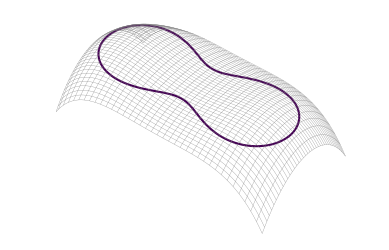

import PostContent from "@components/blog/PostContent.astro";
import SeriesSummary from "@components/content/SeriesSummary.astro";

$$
\providecommand{\line}{\text{---}}
\providecommand{\rowvec}[1]{\;\line\; #1 \;\line\;}

\providecommand{\defeq}{\stackrel{\text{dfn}}{=}}
\providecommand{\then}{\mathop{\mathbb{;}}}
\providecommand{\of}{\circ}

\providecommand{\annotunder}[2]{\underset{\color{gray}#2}{\underline{#1}}}
\providecommand{\annot}[1]{\footnotesize\color{gray}#1}
$$

# Introduction

The information in this post is largely adapted from [@catto2009:modeling-solving], [@catto2014:understanding-constraints], and [@catto2005:temporal-coherence].

<PostContent>
  <SeriesSummary />
</PostContent>

<TodoBlock>
Goals:
* Introduce the concept of Lagrange multipliers
* Understand the meaning of "constraint forces do no work"
</TodoBlock>

# Quoted from [@andrews2022:siggraph-contact-friction] SIGGRAPH

<ExactQuote>The Newton-Euler equations of motion that govern the dynamics of a physical system form a second-order ODE that can be written as</ExactQuote>

$$
M(t) \dot{u}(t) = f(q(t), u(t), t)
$$

where $M(t)$ are the masses, $q(t)$ are the generalized positions, $u(t)$ are the generalized velocities, and $f(t, q(t), u(t))$ are the generalized forces acting on a system.

# Modeling and Solving Constraints

In these notes, 

Consider a bead moving freely along a thin, rigid, two-dimensional wire.

* Use $t \in \R$ to denote time.
* Let $p(t) \in \R^2$ denote the position of the bead at time $t$.

We can describe the wire as a *level curve* of a three-dimensional surface $f : \R^2 \rightarrow \R$.  When $f(x,y) = x^2 + y^2 - r$, curve $C$ is a circle of radius $r$.  More complex shapes are also possible:

<Figure>
  <FigContent ncols={"foo"}>
    <SubFigure>
    
    </SubFigure>
    <SubFigure>
    $$
    \begin{align*}
    f &: \R^2 \rightarrow \R \\
    C &= \{ (x,y) \in \R^2 \mid f(x,y) = 0 \}
    \end{align*}
    $$
    </SubFigure>
  </FigContent>
  <FigCaption>
    asdf
  </FigCaption>
</Figure>

It is helpful to imagine level curves $C$ as paths of equal elevation on a topographic map:

Our goal iw 

Consider a bead with position $p = \begin{bmatrix} p_1 \, p_2 \end{bmatrix}^T$ moving along a two-dimensional rigid wire defined by the implicit curve equation $\phi(p) = 0$.

Imagine a bead on a rigid wire defined 

# Equality Constraints

Consider two physics objects $A$ and $B$ parameterized by the **generalized positions** $x_A, x_B \in \R^d$.  We may sometimes use $x \in \R^{2d}$ to refer to the collection $x = \begin{bmatrix} x_A \; x_B \end{bmatrix}$ of all positions.

A single **pairwise constraint** is a scalar function $\phi : \R^{2d} \rightarrow \R$.  The **constraint vector** $\Phi : \R^{2d} \rightarrow \R^c$ is formed by stacking $c > 0$ constraints $\phi_1, \dots, \phi_c \in \R^{2d}$ together as a column vector:

$$
\Phi(x_A, x_B) =
\begin{bmatrix}
\phi_1(x_A, x_B) \\
\vdots           \\
\phi_c(x_A, x_B)
\end{bmatrix}
\in \R^c
$$

### The Jacobian

The derivative $d_x \Phi \in \R^{c \times 2d}$ of the constraint vector is called the **Jacobian matrix**, which we will refer to simply as $J$.  Its rows are deriviatives of the individual constraint functions:

$$
J \defeq d_x \Phi =
\begin{bmatrix}
\rowvec{d_x \phi_1} \\
\vdots \\
\rowvec{d_x \phi_c}
\end{bmatrix}
\in \R^{c \times 2d}
$$

# Solving Constraints

At every time step, the solver attempts to correct any constraint violations caused by position and velocity updates.  

To enforce $\Phi(x) = 0$ at every time step, we define a time-varying constraint function $C : \R \rightarrow \R^c$,

$$
C(t) \defeq \Phi(x(t)) \quad\forall\, t \in \R
$$

Applying the chain rule yields an expression for the time derivative $d_t C \in \R^{c \times 1}$ at time $t$,

$$
\begin{array}{ccc}
{d_t C} & = & {d_{x(t)} \Phi} &\of& {d_t x} \\
\annot{(c \times 1)} && \annot{(c \times 2d)} &\;& \annot{(2d \times 1)}
\end{array}
$$

In matrix form, $\dot{C} = J V$.  If we assume the constraints are satisfied at the current time, the goal of the constraint solver is to return a velocity $\v_{out}$ such that $\dot{C} = 0$

$$
\boxed{\text{choose } \v_{out} \text{ such that } \dot{C} = J \v_{out} = 0}
$$

<TodoBlock>(is this implicit integration?)</TodoBlock>

## Constraint Forces

As described by [@catto2005:temporal-coherence; @catto2009:modeling-solving], each constraint $c$ will generate an **internal reaction force** $f_c$ acting in the direction of the constraint gradient:

$$
(\forall\, i=1,\dots,c)
\qquad
f_i = \lambda_i (d_x \phi_i) \quad \text{ for some } \lambda_i \in \R
$$

Assembling into a vector, the sum $\f = \sum_{i=1}^c \f_i$ of constraint forces is

$$
\f = J^T \lambda
$$

The final velocity output by the solver will be:

$$
\v_{out} = \v_{in} + \frac{\delta}{m} \f
$$

## Calculating the Jacobian

# Inequality Constraints

# Constraint Resolution