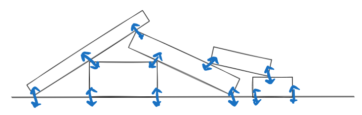
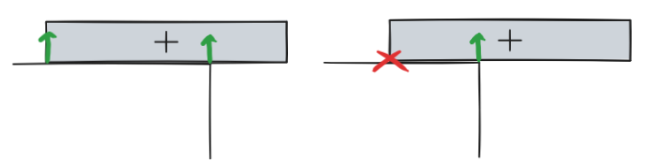
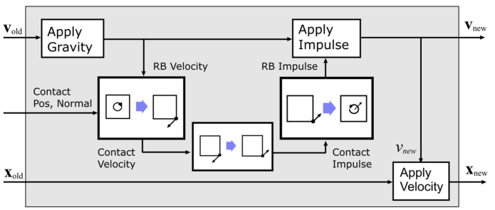

import PostContent from "@components/blog/PostContent.astro";
import SeriesSummary from "@components/content/SeriesSummary.astro";

<PostContent>
  <SeriesSummary />
</PostContent>

## General

[@erleben2005:physics-based-animation]

* Chapter 6, "Impulse-Based Multibody Animation"
  - contains a thorough explanation of multibody physics & the contact model
  - provides justification for simplifying assumptions needed for realtime simulation 
* Chapter 7, "Constraint-Based Multibody Animation"

[@tonge2013:iterative-rigid-body]

* an extended version of [@tonge2012:solving-rigid-body-contacts], the same author's presentation from the previous year
* intuitive schematic depiction of the **sequential impulse** method
* explains velocity-impulse model

Stable piles = Balanced Forces

LCP / Broken Contacts

Rigid Body Motion (2D)

* linear and angular velocity at center of mass uniquely determines movement at all points
* realtime physics engines generally avoid force-acceleration model, favoring impulse-velocity instead
  - friction is more well-behaved (see Baraff "issues in computing contact forces...")
  - resting vs colliding contacts can be treated the same
* impulse
  - "impulsive force" = instantaneous change to velocity
  - impulse = integral of force over time

## Sequential Impulse Algorithm

[@catto2005:temporal-coherence]

* velocity-based scheme with an approximate friction model
* constraint-based approach enables support for wide variety of joint types:  revolute, prismatic, breakable joints, triggers, etc.
* joints and contacts are both handled in the same way
* method for caching contact forces

> Fortunately, the performance and space requirements can be balanced by low accuracy requirements. As long as the motion is visually plausible, the physics programmer is free to modify the equations of motion and to approximate the contact
geometry. Furthermore, the chosen model does not need to be solved to high
precision. As long as stability is maintained, numerical accuracy has secondary
importance. -- [@catto2005:temporal-coherence]

### Kinematics

For a three-dimensional rigid body with center of mass $x$ and quaternion $q$,

$$
\begin{align*}
\dot{x} &= v \\
\dot{q} &= \tfrac{1}{2} \omega * q
\end{align*}
$$

where $v$ is the linear velocity, $\omega$ is the angular velocity, and $*$ denotes quaternion multiplication.  For a system of $n$ bodies, the linear and angular velocities are stacked in a $6n$-by-1 column vector $V$,

$$
V = \begin{bmatrix} v_1 & \omega_1 & \dots & v_n & \omega_n \end{bmatrix}^T \in \R^{6n \times 1}
$$

### Constraints

We allow for pairwise constraints between rigid bodies.  A single position constraint $C_k$ is represented abstractly as a scalar function of $x$ and $q$ for two bodies $i$ and $j$:

$$
C_k(x_i, q_i, x_j, q_j) = 0
$$

The constraints for a system of rigid bodies are collected in an $(s \times 1)$ column vector $C$, where $s$ is the number of constraints.  The time derivative of $C$ yields the velocity constraint vector.

[@catto2009:modeling-solving]

* foo
* bar

[@catto2014:understanding-constraints]

Position Constraints
  * (Flat Plane) $C(p) = n \cdot (p - p_0)$
  * (Circular Section) $C(p) = \lVert p - p_0 \rVert - r$
Contact Constraints
  * (Box B rests on Plane A) $C = (p_B - p_A) \cdot n$
  * Derive to obtain velocity constraint $\dot{C} = (\dot{p}_B - \dot{p}_A) \cdot n + (p_B - p_A) \cdot \dot{n}$
Constraint Impulse
* convert velocity at contact point to center-of-mass velocity and rotation
* effective mass
Global vs. Local Solvers
* solving many constraints at once vs. many constraints at a time
* _sequential impulse solver_ is a local method
* convergence for configurations of stacked circles (light on heavy, heavy on light)
* warm starting -- initialize sequential impulse with the accumulated impulse for each constraint from the previous step
Inequality Constraints
* Projected Gauss-Seidel -- just clamp accumulated impulses!
* improving sequential impulse with block solvers

[@catto2011:soft-constraints]

## Contact Generation

[@andrews2022:siggraph-contact-friction]

* equations of motion
* gap function
* ridid body simulation
* soft body simulation
* numerical methods
* friction modeling

[@gregorious2015:robust-contact]

## Collision Detection

## Extensions & Optimization

[@bergen2010:game-physics-pearls]

[@coumans2014:mlcp-featherstone]

## Continuous Collision Detection

[@catto2013:continuous-collision]

## Linear Complementarity Problems

[@erleben2013:numerical-lcp]

## Numerical Methods

[@catto2015:numerical-methods]

[@catto2009:numerical-integration]

* Differential Equations (projectile motion, mass-spring)
* Numerical Methods (explicit/implicit/symplectic euler, verlet)

https://erkaman.github.io/posts/gauss_seidel_graph_coloring.html

## Reference Implementations

[Cirobb](https://github.com/jonpena/Cirobb) Rigid Body Physics Engine

> Cirobb is a 2D Rigid Body Physics Engine inspired by Box2D Lite that was created with the purpose of helping people who are starting in this wonderful world of physics for Videogames. The Engine uses the Erin Catto's Contact Persistence Algorithm and it's implementation of the PGS (Projected Gauss Seidel) solver to solve the MLCP very well known as a SI (Sequential Impulse).

therealjtgill, [Physics Engine from Scratch](https://www.youtube.com/watch?v=BtJfHoxAc4w) (video)

## Entity Component Systems

* Sander Mertens, Building an ECS](https://ajmmertens.medium.com/building-an-ecs-1-types-hierarchies-and-prefabs-9f07666a1e9d) and [New Version](https://ajmmertens.medium.com/building-an-ecs-1-where-are-my-entities-and-components-63d07c7da742)
